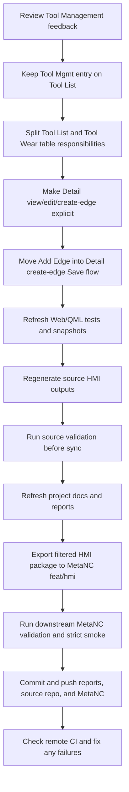

# Workflow Diagram

```mermaid
flowchart TD
  A[Review Tool Management feedback] --> B[Keep Tool Mgmt entry on Tool List]
  B --> C[Split Tool List and Tool Wear table responsibilities]
  C --> D[Make Detail view/edit/create-edge explicit]
  D --> E[Move Add Edge into Detail create-edge Save flow]
  E --> F[Refresh Web/QML tests and snapshots]
  F --> G[Regenerate source HMI outputs]
  G --> H[Run source validation before sync]
  H --> I[Refresh project docs and reports]
  I --> J[Export filtered HMI package to MetaNC feat/hmi]
  J --> K[Run downstream MetaNC validation and strict smoke]
  K --> L[Commit and push reports, source repo, and MetaNC]
  L --> M[Check remote CI and fix any failures]
```
