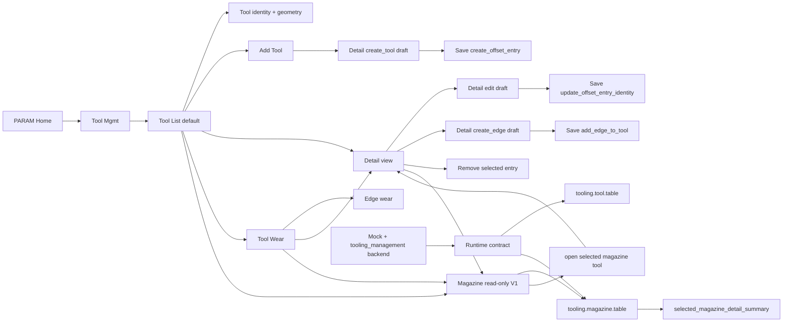

# Architecture Diagram

The operator-facing hierarchy is now consistent: list pages are for scanning,
Detail is for drafting and saving, and Magazine is a module-level read model
that can navigate back into Detail without adding another edit surface.
