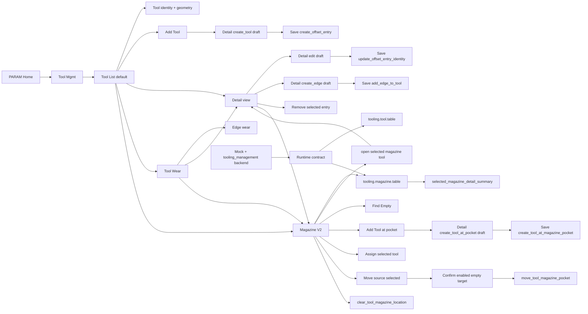

# Architecture Diagram

The operator-facing hierarchy is now consistent: list pages are for scanning,
Detail is for drafting and saving, and Magazine is the module-level pocket
surface. Magazine can navigate back into Detail for assigned tools, create a
tool through Detail at an empty pocket, and run command-mediated pocket
assignment/move/unload flows without adding another edit surface.
