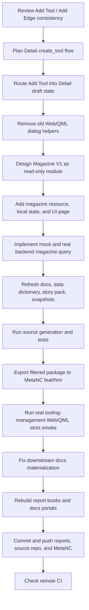

# Workflow Diagram

```mermaid
flowchart TD
  A[Review Add Tool / Add Edge consistency] --> B[Plan Detail create_tool flow]
  B --> C[Route Add Tool into Detail draft state]
  C --> D[Remove old Web/QML dialog helpers]
  D --> E[Design Magazine V1 as read-only module]
  E --> F[Add magazine resource, local state, and UI page]
  F --> G[Implement mock and real backend magazine query]
  G --> H[Refresh docs, data dictionary, story pack, snapshots]
  H --> I[Run source generation and tests]
  I --> J[Export filtered package to MetaNC feat/hmi]
  J --> K[Run real tooling-management Web/QML strict smoke]
  K --> L[Fix downstream docs materialization]
  L --> M[Rebuild report books and docs portals]
  M --> N[Commit and push reports, source repo, and MetaNC]
  N --> O[Check remote CI]
```
