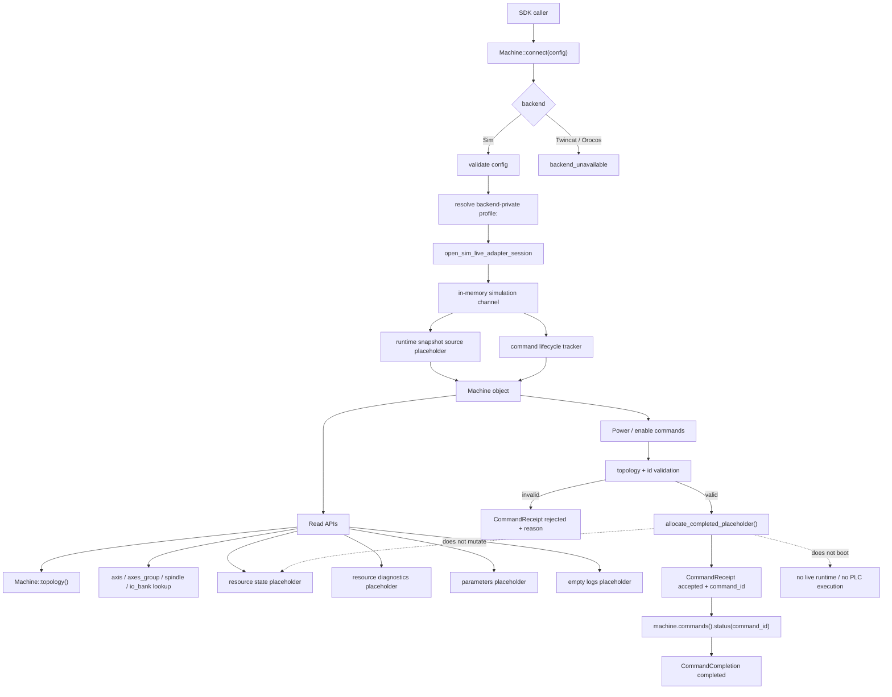
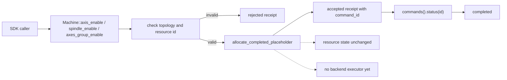
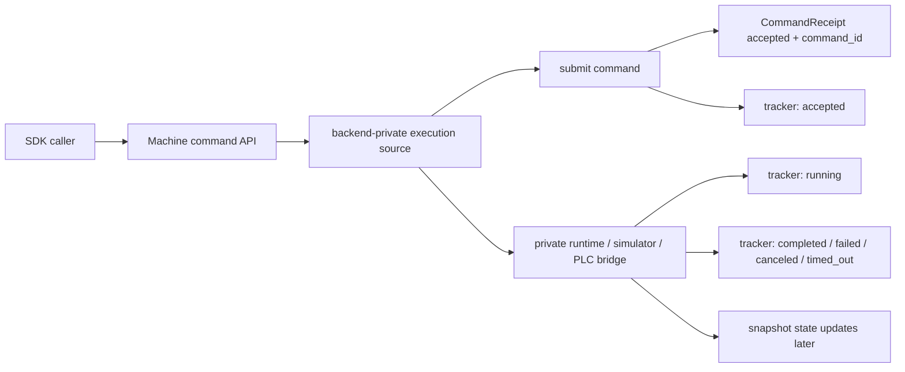

# # AGENTS.md instructions for /home/iaar/workspace/mirror-ccmix-wp/MetaNC <INSTRUCTIONS> # AGENTS.md...

- Session ID: `019e7281-27b4-78a3-9e1e-3cac25e68d2d`
- Session kind: `primary`
- Started: `2026-05-29 14:52:07 +0800`
- CWD: `/home/iaar/workspace/mirror-ccmix-wp/MetaNC`
- Source file: `~/.codex/sessions/2026/05/29/rollout-2026-05-29T14-52-07-019e7281-27b4-78a3-9e1e-3cac25e68d2d.jsonl`
- Messages: `208`
- User prompts: `22`
- Synthetic events: `6`

<a id="turn-1"></a>
## Turn 1

### User
`2026-06-02 08:33:33 +0800`

```
# AGENTS.md instructions for /home/iaar/workspace/mirror-ccmix-wp/MetaNC

<INSTRUCTIONS>
# AGENTS.md

MetaNC is under active development. Favor clarity, small changes, and documentation that helps future contributors understand decisions quickly.

## Required Workflow

- First, read the repository-root [README.md](/README.md).
- Then, complete a scope-orientation pass to identify the related modules defined in [architecture codemap](/docs/dev/architecture.md).
- For each module in scope, read also the `README.md`, `AGENTS.md` files to understand how to work with that module.

</INSTRUCTIONS>

<environment_context>
  <cwd>/home/iaar/workspace/mirror-ccmix-wp/MetaNC</cwd>
  <shell>zsh</shell>
  <current_date>2026-06-02</current_date>
  <timezone>Asia/Shanghai</timezone>
  <filesystem><workspace_roots><root>/home/iaar/workspace/mirror-ccmix-wp/MetaNC</root></workspace_roots><permission_profile type="managed"><file_system type="restricted"><entry access="read"><special>:root</special></entry><entry access="write"><path>/home/iaar/workspace/mirror-ccmix-wp/MetaNC</path></entry><entry access="write"><special>:slash_tmp</special></entry><entry access="write"><special>:tmpdir</special></entry><entry access="read"><path>/home/iaar/workspace/mirror-ccmix-wp/MetaNC/.git</path></entry><entry access="read"><path>/home/iaar/workspace/mirror-ccmix-wp/MetaNC/.agents</path></entry><entry access="read"><path>/home/iaar/workspace/mirror-ccmix-wp/MetaNC/.codex</path></entry></file_system></permission_profile></filesystem>
</environment_context>
```

### Codex
_No Codex response captured for this turn._

<a id="turn-2"></a>
## Turn 2

### User
`2026-06-02 08:33:33 +0800`

```
看一下现在的状态
```

### Codex Response 1 / commentary
`2026-06-02 08:33:54 +0800`

```
我先做一次轻量状态核对：工作区、当前分支、最近提交，以及按仓库要求快速确认相关文档入口。
```

### Codex Response 2 / commentary
`2026-06-02 08:34:24 +0800`

```
现在仓库入口和 `rt-sdk` 说明都能对上当前工作范围。接下来我再补一眼最近提交内容和分支跟踪状态，避免只看 `status` 太粗。
```

### Codex Response 3 / final_answer
`2026-06-02 08:34:44 +0800`

```
当前状态：

- 分支：`feat/plc`
- 跟踪：本地 `feat/plc` 与 `origin/feat/plc` 对齐，基于本地远端引用看没有 ahead/behind。
- 工作区：干净，没有未提交改动。
- HEAD：`5f555792 fix(rt-sdk): keep command lifecycle state private`
- 最近主线仍在推进：本地 `main` 显示落后 `origin/main` 5 个提交，但当前 `feat/plc` 不落后它自己的远端分支。

最近完成的是 RT SDK command lifecycle 的 review 修复：把 `CommandCompletionState` 从公开头文件里收回到私有实现边界，公共 header boundary 测试改成递归扫描，并把 `/rt-sdk/build/` 加进 `.gitignore`。

当前 RT SDK 状态：命令生命周期 tracker 已经有 accepted/running/completed/failed/canceled/timed-out 的内部状态能力，但现有 simulation placeholder profile 仍然保持“接受后立即 completed”的对外行为。下一步真正值得做的是接一个 backend-private 的 command execution source，让私有 tracker 被真实执行源驱动，而不是只做 completed placeholder。

这轮我只做状态核对，没有重新跑完整测试。
```

<a id="turn-3"></a>
## Turn 3

### User
`2026-06-02 09:52:10 +0800`

```
看一下当前的状态
```

### Codex Response 1 / commentary
`2026-06-02 09:52:53 +0800`

```
我再刷新一次当前仓库状态，重点看分支同步、工作区是否干净、最近提交和当前 RT SDK 改动落点。
```

### Codex Response 2 / final_answer
`2026-06-02 09:53:04 +0800`

```
当前状态没变：

- 当前分支：`feat/plc`
- 工作区：干净，没有未提交改动
- 远端同步：`feat/plc` 与 `origin/feat/plc` 对齐
- 最新提交：`5f555792 fix(rt-sdk): keep command lifecycle state private`
- 最近 RT SDK 进度：command lifecycle 已经有内部状态 tracker，公开 API 边界已收紧，header boundary 测试也补强了

额外注意：本地 `main` 目前落后 `origin/main` 5 个提交，但这不影响当前 `feat/plc` 分支自身状态。
```

<a id="turn-4"></a>
## Turn 4

### User
`2026-06-02 09:57:43 +0800`

```
看一下现在工作内容状态
```

### Codex Response 1 / commentary
`2026-06-02 09:58:02 +0800`

```
我会把“工作内容状态”按实现落点看一遍：当前提交、RT SDK 文档描述、command lifecycle 代码、测试覆盖和下一步缺口。
```

### Codex Response 2 / commentary
`2026-06-02 09:58:22 +0800`

```
刚才搜索里我写了一个不存在的根级 `docs/src`，不过 `rt-sdk/docs/src` 的结果已经出来了。我现在补看关键源码和 RT SDK 文档里的“下一步”段落，给你一个按功能切片的状态。
```

### Codex Response 3 / final_answer
`2026-06-02 09:58:44 +0800`

```
当前工作内容状态可以这样看：

当前分支 `feat/plc` 是干净并已同步到 `origin/feat/plc` 的，HEAD 是 `5f555792 fix(rt-sdk): keep command lifecycle state private`。

实际工作落点主要在 `rt-sdk`，不是直接改 `rt/plc` 实现。现在做的是 SDK 侧 runtime/simulation backend 边界：

- 已有 `CommandReceipt.command_id`，power service 接受后会分配 machine-local command id。
- 已有私有 `CommandLifecycleTracker`，内部能表示 `accepted/running/completed/failed/canceled/timed_out`。
- 当前 simulation profile 仍是 placeholder：接受的命令直接返回 `completed`，不会真的驱动状态变化。
- `MachineCommandApi` 公共头已经收紧，`CommandCompletionState`、tracker、record 等实现细节不再暴露到 public header。
- topology/resource state/diagnostics 现在通过 backend-private runtime snapshot source placeholder 读。
- 测试侧已经有 command lifecycle、completion placeholder、public header boundary 等覆盖。

当前最重要的未完成点：

- 还没有 backend-private execution source。
- 命令生命周期还没有被真实执行源驱动，只是内部 tracker 能表达状态。
- power/enable 等命令还不会改变 placeholder resource state。
- 还没有 live command completion tracking。
- 仍然没有，也不应该现在直接把 RT SDK 链到 `/rt/plc` 实现库。

所以现在这条线的阶段是：**SDK runtime 边界和 command lifecycle 私有状态模型已经搭好，下一步该做 execution source，把 accepted -> running -> terminal 的状态转换从 placeholder 推到 backend-private 执行源里。**

这轮我只核对了代码和文档状态，没有重新跑完整测试。
```

<a id="turn-5"></a>
## Turn 5

### User
`2026-06-02 10:01:37 +0800`

```
backend-private execution source 这是什么
```

### Codex Response 1 / commentary
`2026-06-02 10:01:53 +0800`

```
我看一下它在当前 RT SDK 文档里的定义位置，然后用现在代码状态解释，不展开成新实现计划。
```

### Codex Response 2 / commentary
`2026-06-02 10:02:08 +0800`

```
我再补一个源码点：当前命令为什么还是 placeholder，主要看 power service 现在怎么分配 completion。
```

### Codex Response 3 / final_answer
`2026-06-02 10:02:21 +0800`

````
`backend-private execution source` 就是：**RT SDK 后端内部的命令执行入口/执行者**。

它不属于 public SDK API，用户不会直接看到它。SDK 用户只看到：

- `Machine::axis_enable(...)` 这类命令调用
- 返回的 `CommandReceipt`
- 后续用 `machine.commands().status(command_id)` 查 `CommandCompletion`

中间真正“把命令交给谁执行、怎么推进状态”的东西，就是这个 execution source。

现在的问题是：当前代码还没有它。比如 `Machine::axis_enable()` 现在只是：

1. 检查资源 id 是否存在；
2. 分配一个 command id；
3. 直接把这个 id 标记成 `completed` placeholder；
4. 不改变 axis state，也不模拟运行过程。

所以当前状态是：

```text
SDK caller
  -> Machine::axis_enable()
  -> allocate_completed_placeholder()
  -> receipt accepted + command_id
  -> status(command_id) == completed
```

有 execution source 后，形态会变成：

```text
SDK caller
  -> Machine::axis_enable()
  -> backend-private execution source.submit(command)
  -> receipt accepted + command_id
  -> tracker: accepted
  -> execution source 推进 tracker: running
  -> execution source 完成后: completed / failed / canceled / timed_out
```

它的价值是把三件事分开：

- public SDK contract：只管 receipt、completion、state DTO。
- simulation backend：负责把 SDK 命令映射成后端内部执行请求。
- runtime/simulator/PLC/private harness：负责实际执行或模拟执行。

为什么叫 `backend-private`：因为它必须藏在 `rt-sdk/src` 或后端实现里，不能暴露 `/rt/plc` 类型、PLC command class、runtime command string、`CommandResult::lines` 等细节。这样以后接本地 simulator、Orocos、OPC UA、PLC bridge，都不会污染 public SDK。

当前下一步说白了就是：**别再在 `Machine::accept_*_power()` 里直接 `allocate_completed_placeholder()`，而是通过一个私有 execution source 提交命令，让 tracker 的状态由执行源来驱动。**
````

<a id="turn-6"></a>
## Turn 6

### User
`2026-06-02 10:03:03 +0800`

```
这些是啥，具体的后端执行吗
```

### Codex Response 1 / final_answer
`2026-06-02 10:03:27 +0800`

````
是的，方向上就是“具体后端执行”，但更准确地说它是 **RT SDK 内部的后端执行适配层**，不是公开 API，也不一定等于真正的 PLC/runtime 本体。

现在代码里还没有这个层。当前 power 命令还是在 [rt-sdk/src/machine.cpp](/home/iaar/workspace/mirror-ccmix-wp/MetaNC/rt-sdk/src/machine.cpp:399) 里直接做 placeholder：

```text
检查资源存在
-> allocate_completed_placeholder()
-> 返回 accepted receipt
-> status(id) 立即 completed
```

未来的后端执行应分两层：

```text
Public SDK
  Machine::axis_enable(1)

SDK backend-private execution source
  submit(AxisPowerCommand{axis=1, enable=true})
  分配 command_id
  驱动 tracker: accepted -> running -> completed/failed

真正 runtime/sim/PLC 执行体
  做实际状态变化、仿真扫描、PLC bridge、Orocos 通信等
```

所以 `execution source` 不是给用户调用的东西，而是 SDK 后端内部用来承接命令的对象。它可以有几种实现：

- placeholder executor：提交后立即 completed，用来保持当前行为。
- simulation executor：提交后模拟运行，可能先 running，之后 completed，并更新 snapshot state。
- live adapter executor：通过私有 session 调 runtime、PLC local facade、进程、socket、OPC UA 等。
- test executor：测试里可控地推进状态，覆盖 failed/canceled/timed_out。

现在已有的是 session 外壳，比如 [rt-sdk/src/sim_live_adapter.hpp](/home/iaar/workspace/mirror-ccmix-wp/MetaNC/rt-sdk/src/sim_live_adapter.hpp:32) 里有 `commands` tracker 和 `snapshots`，但它还没有“提交命令并执行”的源。文档里的意思就是下一步要补这个私有执行入口。

一句话：**它就是 SDK 后端内部的 command executor/source，用来把 public SDK 命令变成后端私有执行，并驱动 command lifecycle；但真正 PLC/runtime 执行仍然应该藏在它后面。**
````

<a id="turn-7"></a>
## Turn 7

### User
`2026-06-02 10:03:48 +0800`

```
但是这些是涉及到具体的cnc或者什么把
```

### Codex Response 1 / final_answer
`2026-06-02 10:04:09 +0800`

````
对，**最终会碰到具体 CNC/runtime**，但不是现在这一层直接承载。

可以按层看：

```text
G-code / 程序执行 / CNC 工艺语义
  -> nrt/gcode_parser, nc_kernel, scheduler 等

RT SDK public API
  -> Machine::axis_enable(), spindle_enable(), commands().status()
  -> 只定义稳定的机器对象、命令 receipt、completion、state DTO

RT SDK backend-private execution source
  -> SDK 后端内部命令执行入口
  -> 把 public SDK 命令转成后端私有执行请求
  -> 驱动 command lifecycle

具体 CNC runtime / PLC / motion / HAL
  -> 真正执行机器逻辑、互锁、安全、伺服、I/O、运动
```

所以 `execution source` **会连接到具体后端执行**，但它本身不应该写死某台 CNC 的完整逻辑。它更像适配器：

- 当前阶段：只处理 SDK 已有的 power/enable 类命令。
- 不做：G-code、插补、轨迹规划、刀具交换、PLC 顺控完整语义。
- 可以做：提交命令、分配/推进 command id、把后端结果映射成 `completed/failed/timed_out`。
- 未来可以接：simulation runtime、PLC local facade、Orocos、OPC UA、进程/Socket bridge。

现在代码里具体相关的是 [rt-sdk/src/machine.cpp](/home/iaar/workspace/mirror-ccmix-wp/MetaNC/rt-sdk/src/machine.cpp:399) 的这些 power service。它们现在还是直接 `allocate_completed_placeholder()`，所以没有真正 CNC 行为。

下一步如果做得克制，范围应该是：

```text
axis/spindle/axes_group power command
  -> backend-private executor
  -> tracker 状态 accepted/running/completed
  -> 可选更新 simulation snapshot state
```

而不是直接开始实现“具体 CNC 控制系统”。真正的 CNC 机床差异，比如安全互锁、轴组约束、PLC 顺控、伺服状态、硬件 I/O，应该留在 runtime/profile/PLC 层，SDK 只负责映射和观察。
````

<a id="turn-8"></a>
## Turn 8

### User
`2026-06-02 10:15:36 +0800`

```
那现在感觉能做什么
```

### Codex Response 1 / final_answer
`2026-06-02 10:15:58 +0800`

```
现在最值得做的是一个很小的后端执行切片，不碰完整 CNC 语义：

**推荐下一步：加 private command executor，但先保持当前 placeholder 行为。**

具体做法：

1. 在 `rt-sdk/src` 里加一个 backend-private executor/source，比如 `SimCommandExecutionSource`。
2. `Machine::axis_enable()` / `spindle_enable()` / `axes_group_enable()` 不再直接 `allocate_completed_placeholder()`。
3. 改成调用 executor 的 `submit_power_command(...)`。
4. executor 内部现在仍然立即 `completed`，所以 public 行为不变。
5. 测试覆盖：确认 receipt/status 行为不变，并确认 public header 没泄漏 executor 类型。

这个切片的价值是先把结构打正：以后要接 simulation runtime、PLC facade、Orocos 或 OPC UA，就接 executor 后面，不再污染 `Machine` public API。

第二步才适合做：

- executor 提交后先 `accepted/running`，再 `completed`。
- 可控测试里手动推进状态。
- 仍然不改真实 axis/spindle state。

第三步再做：

- simulation snapshot 可变化。
- axis enable 后 `axis.state().enabled == true`。
- wait helper 能观察到状态变化。

暂时不建议现在做：

- 直接接 `/rt/plc` 实现库。
- 开始写完整 CNC runtime。
- 做 G-code、插补、刀具、PLC 顺控完整语义。
- 把 runtime command 类型暴露进 RT SDK public headers。

所以我建议下一件事就是：**做“private executor seam + 保持 placeholder 行为”的结构切片**。风险低，能把后续真实 runtime 执行的接入点先放稳。
```

<a id="turn-9"></a>
## Turn 9

### User
`2026-06-02 10:54:38 +0800`

```
列一下目前支持的功能
```

### Codex Response 1 / commentary
`2026-06-02 10:54:54 +0800`

```
我按当前 `rt-sdk` 已实现/已测试的能力来列，不把文档里“未来 live”的部分算进去。
```

### Codex Response 2 / final_answer
`2026-06-02 10:55:07 +0800`

```
目前这条 `feat/plc` 线上，实际支持的是 **RT SDK 的 simulation placeholder 能力**，不是完整 CNC runtime。

**已支持**

- `Machine::connect()`
  - 支持 `SdkBackend::Sim`
  - 支持 backend-private 的 `profile:<name>` placeholder profile
  - 已有连接配置校验和标准 `ConnectResult` 错误形态
  - `Twincat` / `Orocos` 后端枚举存在，但实际返回未实现/不可用

- Machine 基础对象
  - `Machine::valid()`
  - `Machine::topology()`
  - `Machine::logs()`
  - `Machine::commands()`
  - `Machine::parameters()`

- 拓扑查询
  - placeholder machine topology
  - axes / axes group / spindle / IO bank 信息
  - topology revision
  - resource lookup revision guard
  - resource handle 保存 lookup 时的 topology revision

- 资源 handle
  - `axis(id)`
  - `axes_group(id)`
  - `spindle(id)`
  - `io_bank(id)`
  - 能读 `info()`
  - 能读 placeholder `state()`
  - 能读 placeholder `diagnostics()`
  - 能访问 resource parameter alias

- Placeholder 状态/诊断
  - axis 初始 servo off / disabled / position 0
  - axes group 初始 servo off / disabled
  - spindle 初始 stopped / speed 0
  - IO bank placeholder state/diagnostics
  - diagnostics 当前是非 faulted placeholder

- 参数 API
  - machine parameters read-only placeholder
  - resource parameters alias
  - list/snapshot 返回空 placeholder
  - 暂不支持真实 metadata/write/apply/store/load

- Logs API
  - `Machine::logs()` 可读
  - 当前返回空日志页 placeholder

- Power/enable 类命令 receipt
  - axes group enable/disable/servo on/off
  - standalone axis enable/disable/servo on/off
  - spindle enable/disable/servo on/off
  - 会做基本 topology/id 校验
  - accepted receipt 带 machine-local `command_id`
  - rejected receipt 有 public rejection reason

- Command completion
  - `machine.commands().status(command_id)`
  - 已支持 public completion DTO
  - 内部 tracker 能表达 `accepted/running/completed/failed/canceled/timed_out/unknown`
  - 当前 connected placeholder profile 对 accepted 命令仍然立即 `completed`

- Wait helper
  - axes group wait helper 已有
  - 当前只读一次 placeholder snapshot
  - servo off / disabled 会立即 reached
  - servo on / enabled 会 timeout
  - 不轮询、不等待真实 runtime

- Backend-private skeleton
  - in-memory simulation channel placeholder
  - private live adapter session skeleton
  - private runtime snapshot source placeholder
  - private command lifecycle tracker
  - public header boundary 已加测试，内部类型不暴露

**明确还不支持**

- 真实 CNC runtime boot
- 真实 PLC 顺控
- 真实 command execution source
- command 驱动 resource state 变化
- live command completion tracking
- live logs / live diagnostics / live parameters
- G-code 执行、插补、运动规划、刀具交换
- 直接链接 `/rt/plc`、Orocos RTT、TwinCAT runtime 实现
- public simulation endpoint grammar 或 wire protocol
```

<a id="turn-10"></a>
## Turn 10

### User
`2026-06-02 10:55:11 +0800`

```
用图表形式
```

### Codex Response 1 / final_answer
`2026-06-02 10:55:38 +0800`

````
```text
当前 RT SDK / Simulation Placeholder 功能状态

┌──────────────────────────────┬──────────────┬──────────────────────────────────────┐
│ 功能区                       │ 状态         │ 说明                                 │
├──────────────────────────────┼──────────────┼──────────────────────────────────────┤
│ Sim backend connect          │ 已支持       │ 支持 backend-private profile:<name>  │
│ Twincat / Orocos backend     │ 未实现       │ 枚举存在，连接返回 unavailable       │
│ Machine object               │ 已支持       │ valid/topology/logs/commands/params  │
│ Topology                     │ 已支持       │ placeholder topology + revision      │
│ Resource lookup              │ 已支持       │ axis/group/spindle/io bank lookup    │
│ Lookup revision guard        │ 已支持       │ 可检测 topology revision mismatch    │
│ Resource handles             │ 已支持       │ info/state/diagnostics/parameters    │
│ Resource state               │ Placeholder  │ 静态状态，不随命令变化               │
│ Resource diagnostics         │ Placeholder  │ 静态非 faulted diagnostics           │
│ Machine parameters           │ Placeholder  │ 只读，list/snapshot 为空             │
│ Resource parameters          │ Placeholder  │ machine parameters 的资源别名        │
│ Logs                         │ Placeholder  │ 可读，当前为空日志页                 │
│ Power/enable commands        │ Placeholder  │ 校验 id，返回 receipt + command_id   │
│ Command receipt              │ 已支持       │ accepted/rejected + reason/id        │
│ Command completion status    │ 已支持       │ status(command_id) 可查询            │
│ Command lifecycle tracker    │ 内部已支持   │ 可表达 accepted/running/completed 等 │
│ Wait helpers                 │ Placeholder  │ 单次读 snapshot，不轮询              │
│ Live adapter skeleton        │ 内部已支持   │ 有 session/snapshot/tracker 外壳     │
│ Public header boundary guard │ 已支持       │ 测试防止内部类型泄漏                 │
└──────────────────────────────┴──────────────┴──────────────────────────────────────┘
```

```text
当前命令执行链路

┌────────────┐
│ SDK caller │
└─────┬──────┘
      │ Machine::axis_enable()
      ▼
┌────────────────────┐
│ Machine public API │
└─────┬──────────────┘
      │ 校验 topology/id
      ▼
┌──────────────────────────────┐
│ CommandLifecycleTracker       │
│ allocate_completed_placeholder│
└─────┬────────────────────────┘
      │
      ▼
┌──────────────────────────────┐
│ CommandReceipt                │
│ accepted + command_id         │
└─────┬────────────────────────┘
      │ commands().status(id)
      ▼
┌──────────────────────────────┐
│ CommandCompletion             │
│ completed                     │
└──────────────────────────────┘

说明：现在没有真实 executor，命令不会改变 resource state。
```

```text
后续目标链路

┌────────────┐
│ SDK caller │
└─────┬──────┘
      ▼
┌────────────────────┐
│ Machine public API │
└─────┬──────────────┘
      ▼
┌──────────────────────────────┐
│ Backend-private executor      │
│ submit power command          │
└─────┬────────────────────────┘
      ▼
┌──────────────────────────────┐
│ CommandLifecycleTracker       │
│ accepted -> running -> done   │
└─────┬────────────────────────┘
      ▼
┌──────────────────────────────┐
│ Runtime / Sim / PLC private   │
│ 真正执行或模拟执行            │
└─────┬────────────────────────┘
      ▼
┌──────────────────────────────┐
│ Snapshot / State / Diagnostics│
│ 后续可观察状态变化            │
└──────────────────────────────┘
```

```text
未支持能力

┌─────────────────────────────┬────────┬────────────────────────────┐
│ 能力                        │ 状态   │ 备注                       │
├─────────────────────────────┼────────┼────────────────────────────┤
│ 真实 CNC runtime boot        │ 未支持 │ 当前不启动 runtime         │
│ 真实 PLC 顺控                │ 未支持 │ 不直接链接 /rt/plc         │
│ Backend-private executor     │ 未支持 │ 下一步推荐切片             │
│ 命令驱动状态变化             │ 未支持 │ enable 不会改变 enabled    │
│ Live command completion      │ 未支持 │ 当前立即 completed         │
│ Live logs / diagnostics      │ 未支持 │ 当前是静态 placeholder     │
│ Live parameters write/apply  │ 未支持 │ 当前只读空 placeholder     │
│ G-code 执行                  │ 未支持 │ 不在 RT SDK 当前切片       │
│ 插补/运动规划                │ 未支持 │ 属于其他 runtime/pipeline  │
│ 刀具交换                     │ 未支持 │ 未进入当前范围             │
│ Public sim endpoint grammar  │ 未支持 │ profile:<name> 仍为私有    │
│ Wire protocol                │ 未支持 │ JSON/socket/protobuf 均未定 │
└─────────────────────────────┴────────┴────────────────────────────┘
```
````

<a id="turn-11"></a>
## Turn 11

### User
`2026-06-02 12:52:27 +0800`

```
能把现在这种生成流程图吗
```

### Codex Response 1 / final_answer
`2026-06-02 12:52:51 +0800`

````
可以。下面这个就是**当前已实现的 RT SDK simulation placeholder 流程图**，可以直接放进 Markdown / mdbook 的 Mermaid 块里。



更简化的当前命令路径：



下一步目标会变成这样：



当前关键点：现在图里的 `backend-private execution source` 还没有实现，所以命令是直接走 `allocate_completed_placeholder()`，不会改变资源状态。
````

<a id="turn-12"></a>
## Turn 12

### User
`2026-06-02 12:53:09 +0800`

```
我的意思是用imagegen做图
```

### Codex Response 1 / commentary
`2026-06-02 12:53:20 +0800`

```
我会用 `imagegen` 技能来做一张流程图图片；先看一下该技能要求和可用输出方式。
```

### Codex Response 2 / commentary
`2026-06-02 12:53:39 +0800`

```
`imagegen` 技能我已经读取了；当前会话里没有暴露内置 `image_gen` 工具，所以不能直接调用模型出图。我可以先用本地确定性方式生成一张流程图 PNG/SVG 放到仓库里；如果你坚持要模型生成图，则需要走 CLI fallback，并且通常需要 `OPENAI_API_KEY`。
```

### Codex Response 3 / final_answer
`2026-06-02 12:54:01 +0800`

```
可以，但当前会话没有暴露内置 `image_gen` 工具，所以我现在不能直接调用 imagegen 出图。

可选做法：

1. 我先用本地方式生成一张确定性的流程图图片，比如 `SVG/PNG`，放到仓库里。
2. 如果你坚持要模型生成的 imagegen 风格图，需要走 CLI fallback，通常需要 `OPENAI_API_KEY`，你确认后我再跑。

我建议先做本地 `SVG/PNG` 流程图：这种技术架构图文字准确性更可控。
```

<a id="turn-13"></a>
## Turn 13

### User
`2026-06-02 12:54:20 +0800`

```
.zshrc里已经谢了OPENAI_API_KEY了
```

### Codex Response 1 / commentary
`2026-06-02 12:54:39 +0800`

```
可以，那我按 `imagegen` 的 CLI fallback 走。因为这是技术流程图，我会用一句比较严格的 prompt 控制文字和布局，并把成品保存到仓库里的一个明确路径。
```

### Codex Response 2 / commentary
`2026-06-02 12:54:59 +0800`

```
我会生成一张 `RT SDK simulation placeholder` 当前流程图，先放在 `output/imagegen/rt-sdk-sim-placeholder-flow.png`。生成后我会用本地预览检查文字和结构是否可用。
```

### Codex Response 3 / commentary
`2026-06-02 12:55:08 +0800`

```
现在调用 imagegen CLI，需要网络访问 OpenAI API；我会请求一次提升权限来完成生成。
```

### Codex Response 4 / commentary
`2026-06-02 12:55:35 +0800`

```
外部 imagegen 调用被安全审查拦下了，原因是 prompt 里包含当前私有仓库的架构细节，会发到外部 API。为了继续推进，我改用本地确定性图形生成，不外发仓库内容，输出同样是图片文件。
```

### Codex Response 5 / commentary
`2026-06-02 12:55:43 +0800`

```
我先生成一个本地 SVG 版本，图的内容和刚才的流程一致；随后如果系统有 `rsvg-convert`/`magick`，我再渲染成 PNG 方便直接查看。
```

### Codex Response 6 / commentary
`2026-06-02 12:55:51 +0800`

```
本地有 `rsvg-convert`，可以把 SVG 渲染成 PNG。我现在写入 `output/imagegen/rt-sdk-sim-placeholder-flow.svg`，再导出 PNG。
```

### Codex Response 7 / commentary
`2026-06-02 12:57:25 +0800`

```
SVG 已生成。我现在用 `rsvg-convert` 导出 PNG，并检查文件是否存在和尺寸。
```

### Codex Response 8 / commentary
`2026-06-02 12:57:38 +0800`

```
导出完成。`git status` 那次和渲染并行跑得太早，没看到新文件；我再单独核对输出文件和工作区。
```

### Codex Response 9 / commentary
`2026-06-02 12:57:47 +0800`

```
我还会目检一下 PNG，确认它不是空图、布局没有明显重叠，再给你路径。
```

### Codex Response 10 / final_answer
`2026-06-02 12:58:09 +0800`

```
不是 API key 问题。外部 `imagegen` CLI 调用被安全审查拦下了，因为 prompt 里包含当前仓库的架构细节，会发送到外部 API。

我改成了本地确定性生成，已经产出图片：

- PNG：[rt-sdk-sim-placeholder-flow.png](/home/iaar/workspace/mirror-ccmix-wp/MetaNC/output/imagegen/rt-sdk-sim-placeholder-flow.png)
- SVG：[rt-sdk-sim-placeholder-flow.svg](/home/iaar/workspace/mirror-ccmix-wp/MetaNC/output/imagegen/rt-sdk-sim-placeholder-flow.svg)

图片尺寸是 `2048x1152`，我已经目检过，内容可读，包含当前 connection/session seed、read APIs、command path，以及 `no live runtime boot / no PLC execution / resource state unchanged` 三个限制说明。

最终没有成功使用外部 imagegen；实际成品是本地 SVG 渲染成 PNG。若要继续走外部 imagegen，需要你明确确认允许把这类项目架构内容发送到 OpenAI 图像 API。
```

<a id="turn-14"></a>
## Turn 14

### User
`2026-06-02 13:08:04 +0800`

```
只发送你上面总结的部分图表
```

### Codex Response 1 / commentary
`2026-06-02 13:08:21 +0800`

```
我会按 `imagegen` 技能走 CLI fallback，但这次只发一个去项目化的通用流程图 prompt：不包含仓库名、路径、提交、源码函数名或私有模块名，只保留“SDK caller / sim backend / placeholder reads / command completion”这种概念级标签。
```

### Codex Response 2 / commentary
`2026-06-02 13:08:49 +0800`

```
我会先用低风险通用 prompt 生成一版，如果生成成功再目检。输出文件名用 `generic-sdk-placeholder-flow.png`，避免覆盖刚才的本地图。
```

### Codex Response 3 / commentary
`2026-06-02 13:09:18 +0800`

```
这次外部调用没有被安全拦下，失败点是当前 Python 环境没装 `openai` SDK。我先查一下本机有没有可用的 uv 或现成环境，尽量不污染仓库依赖。
```

### Codex Response 4 / commentary
`2026-06-02 13:09:29 +0800`

```
没有现成 venv。为了不改项目依赖，我会在 `/tmp` 建一个临时 venv 装 `openai`，然后复用同一个 imagegen 脚本生成图。需要联网安装 Python 包。
```

### Codex Response 5 / commentary
`2026-06-02 13:09:48 +0800`

```
`uv` 默认要写 home cache，沙箱里不可写。我会把临时环境和 cache 都放 `/tmp`，先建 venv；安装 `openai` 时再走一次明确的联网授权。
```

### Codex Response 6 / commentary
`2026-06-02 13:10:05 +0800`

```
临时 venv 创建还在跑，我等它完成后安装依赖。
```

### Codex Response 7 / commentary
`2026-06-02 13:10:14 +0800`

```
venv 已建好。现在安装 `openai` 到 `/tmp/imagegen-openai-venv`，这一步需要访问包索引。
```

### Codex Response 8 / commentary
`2026-06-02 13:10:58 +0800`

```
安装还在进行，我继续等，结束后马上跑图像生成。
```

### Codex Response 9 / commentary
`2026-06-02 13:11:35 +0800`

```
`pip install` 还没有返回输出，可能在下载/安装依赖。我再等一轮；如果超时会改用已有本地图作为交付，不继续卡住。
```

### Codex Response 10 / commentary
`2026-06-02 13:12:12 +0800`

```
安装进程仍在运行但没有新输出，像是网络下载卡住了。我再给它一次短等待；如果还不动，会终止这个临时安装流程并保留已经生成的本地图。
```

### Codex Response 11 / commentary
`2026-06-02 13:12:49 +0800`

```
这个安装已经连续几轮没有进展，我按刚才说的先中止，避免把会话卡在依赖下载上。
```

### Codex Response 12 / commentary
`2026-06-02 13:13:11 +0800`

```
我确认一下临时安装进程实际状态；刚才 stdin 已经关闭，可能是进程结束了但工具没有回传完整尾部。
```

### Codex Response 13 / commentary
`2026-06-02 13:13:24 +0800`

```
`openai` 实际已经装好了，刚才是输出回传卡住。现在我用临时 venv 直接跑通用 prompt 的 imagegen 生成。
```

### Codex Response 14 / commentary
`2026-06-02 13:14:19 +0800`

```
图像 API 已开始生成，通常要一两分钟。我会等结果，随后检查图片质量。
```

### Codex Response 15 / commentary
`2026-06-02 13:14:54 +0800`

```
生成仍在跑，还没有返回。继续等一轮。
```

### Codex Response 16 / commentary
`2026-06-02 13:15:32 +0800`

```
还在等待图像 API 返回。这个调用没有本地改动风险，我再等一次；如果 API 超时我会保留本地确定性图并说明失败点。
```

### Codex Response 17 / commentary
`2026-06-02 13:16:08 +0800`

```
已经超过常规等待时间但进程仍未返回。我再确认一次，避免中断一个即将完成的生成。
```

### Codex Response 18 / commentary
`2026-06-02 13:16:47 +0800`

```
这个 imagegen 调用已经跑了几分钟没有输出。我再等最后一轮；如果还是不返回，我会终止这次外部生成，避免后台进程悬着。
```

### Codex Response 19 / commentary
`2026-06-02 13:17:10 +0800`

```
外部 imagegen 已完成。我现在目检生成图，重点看是否误写了项目名、文字是否可读、是否满足“只发总结图表”的范围。
```

### Codex Response 20 / commentary
`2026-06-02 13:17:19 +0800`

```
文件已经存在但 `git status` 没列出来，说明 `output/` 可能被忽略了；作为交付文件路径可用。我现在打开图片做质量检查。
```

### Codex Response 21 / final_answer
`2026-06-02 13:17:36 +0800`

```
已按你的意思重新用 imagegen 生成了一张，只发送了通用化的总结图表内容，没有发送仓库名、路径、提交或私有源码细节。

生成结果：

- [generic-sdk-placeholder-flow.png](/home/iaar/workspace/mirror-ccmix-wp/MetaNC/output/imagegen/generic-sdk-placeholder-flow.png)

我也保留了之前本地确定性版本：

- [rt-sdk-sim-placeholder-flow.png](/home/iaar/workspace/mirror-ccmix-wp/MetaNC/output/imagegen/rt-sdk-sim-placeholder-flow.png)
- [rt-sdk-sim-placeholder-flow.svg](/home/iaar/workspace/mirror-ccmix-wp/MetaNC/output/imagegen/rt-sdk-sim-placeholder-flow.svg)

这次 imagegen 图文字基本可读，内容是概念版流程图。`output/` 目录目前看起来被 git 忽略，所以这些文件不会自动进提交。
```

<a id="turn-15"></a>
## Turn 15

### User
`2026-06-02 14:10:58 +0800`

```
审查一下现在的plc runtime功能和文档
```

### Codex Response 1 / commentary
`2026-06-02 14:11:22 +0800`

```
我会按“代码审查 + 文档审查”的方式看，使用 `review-docs-comprehension` 来覆盖文档可读性问题；同时先做一遍仓库要求的 README、架构图谱和 `rt/plc` 模块入口确认。
```

### Codex Response 2 / commentary
`2026-06-02 14:11:48 +0800`

```
`review-docs-comprehension` 的路径刚才按全局 skills 找错了；这个仓库里的 skill 在 `.agents/skills` 下。我会重新读取它，然后开始看 `rt/plc` 的代码和文档。
```

### Codex Response 3 / commentary
`2026-06-02 14:12:19 +0800`

```
`rt/plc` 入口已经确认：只有模块 README，没有模块 AGENTS。接下来我聚焦 runtime 相关代码：`Framework`、runtime/session/command adapter、scenario/terminal bridge，以及 capability/docs 的对应描述，找功能和文档是否互相打架。
```

### Codex Response 4 / commentary
`2026-06-02 14:12:49 +0800`

```
我已经拿到当前 `rt/plc` 的入口、能力文档和 roadmap。现在继续看 runtime 实现本体和测试矩阵，重点找“文档声称支持但代码/测试没兜住”以及 runtime 语义上的真实风险。
```

### Codex Response 5 / commentary
`2026-06-02 14:13:08 +0800`

```
第一次 `framework.cpp` 只到中段，我继续读运行周期、shutdown、reload、snapshot 这些关键实现。
```

### Codex Response 6 / commentary
`2026-06-02 14:13:39 +0800`

```
我已经看完核心 runtime 路径的第一层：现在 PLC 有本地 runtime session、command executor、local facade，但仍明确不是生产 runtime/外部 adapter。接下来我查文档引用和测试命名，确认 capability 表里的证据是否真的存在。
```

### Codex Response 7 / commentary
`2026-06-02 14:14:28 +0800`

```
测试矩阵里能看到 story30/32/33/35/43 的目标和标签都存在。现在我再查故事索引和关键 story 的 front matter，确认 “STORY-01..43 已实现” 是否和单个故事状态一致。
```

### Codex Response 8 / commentary
`2026-06-02 14:15:00 +0800`

```
我看到一个可能的文档/证据错位点：能力表说 Sequence 的 sub-sequence/if-else/parallel 已支持，但展示证据只列 `story04/story14/story15`。我会核对这些 API 是否确实在测试里覆盖，而不是只按故事状态判断。
```

### Codex Response 9 / commentary
`2026-06-02 14:15:31 +0800`

```
Story-16 的 sequence 扩展确实在 `story04_sequence_tests` 里覆盖了，所以能力表这一点不是假能力，但“怎么展示它”的证据列不够直观。接下来我跑一遍 PLC 构建/测试和 docs 校验，看当前状态是否实际绿。
```

### Codex Response 10 / commentary
`2026-06-02 14:15:45 +0800`

```
配置和文档 lint 已通过。我现在串行构建 PLC，再跑 `ctest`，避免并发写同一个 build 目录造成干扰。
```

### Codex Response 11 / commentary
`2026-06-02 14:16:25 +0800`

```
PLC 构建还在跑，进度正常；我继续等到完成再跑测试。
```

### Codex Response 12 / commentary
`2026-06-02 14:17:10 +0800`

```
构建过半，仍然正常。等完成后我会跑全量 `ctest`，再根据代码/文档审查给出问题列表。
```

### Codex Response 13 / commentary
`2026-06-02 14:17:53 +0800`

```
构建接近完成，我继续等待最后几个测试目标链接完。
```

### Codex Response 14 / commentary
`2026-06-02 14:18:08 +0800`

```
PLC 构建通过。现在跑全量 `ctest --output-on-failure`。
```

### Codex Response 15 / commentary
`2026-06-02 14:18:22 +0800`

```
全量 PLC 测试绿。最后我再跑 `book build`，并快速查工作区是否因本次构建生成了可见改动。
```

### Codex Response 16 / commentary
`2026-06-02 14:18:46 +0800`

```
验证已经完成：PLC 构建、81 个测试、docs lint 和 `book build` 都通过。我再取一下前序记忆的行号，用于说明这次审查参考了之前 PLC review 的上下文。
```

### Codex Response 17 / final_answer
`2026-06-02 14:19:36 +0800`

```
**发现**

1. 文档展示证据不够精确：`CURRENT-CAPABILITIES.md` 里 Behavior author API 写了 sub-sequences、conditionals、parallel branches，但 “How to show it” 只说跑 `story04/story14/story15`。实际 Story-16 的这些能力确实被 `story04_sequence_tests` 覆盖，不过第一次读的人会以为 Story-16 没有独立证据或能力表漏了 Story-16。建议把证据列改成 `story04_sequence_tests`，并显式写 “includes Story-16 sequence control-flow coverage”。位置：[CURRENT-CAPABILITIES.md](/home/iaar/workspace/mirror-ccmix-wp/MetaNC/rt/plc/docs/CURRENT-CAPABILITIES.md:30)

2. `RuntimeSimulationSession::shutdown()` 在异常路径上有一个小的状态一致性风险。`Framework::shutdown()` 理论上会在进入 `STOPPED` 后因 backend shutdown failure 抛异常；如果这里抛出，`RuntimeSimulationSession::booted_` 不会被清 false，后续同一个 session 再 `boot()` 会直接 return，可能留下 “session 认为 booted，但 framework 已 stopped” 的状态。当前 demo backends 基本不触发，所以不是当前测试失败点，但这是 runtime 生命周期语义上值得补的边缘用例。位置：[runtime_simulation_session.cpp](/home/iaar/workspace/mirror-ccmix-wp/MetaNC/rt/plc/src/runtime_simulation_session.cpp:45)，相关 shutdown 抛出点：[framework.cpp](/home/iaar/workspace/mirror-ccmix-wp/MetaNC/rt/plc/src/framework.cpp:851)

3. 当前 runtime adapter/facade 仍是 PLC-local，不是生产 runtime 或外部 transport。文档总体说清楚了，但 `CURRENT-CAPABILITIES.md` 功能表很长，容易让读者把 `RuntimeSimulationSession`、`CommandExecutor`、`LocalRuntimeAdapter` 理解成已经可接 SDK/HMI 的真实 adapter。`IMPLEMENTATION-READINESS.md` 已经解释了边界，建议在能力表的 adapter 行尾部再加一句 “PLC-local only; no transport or SDK API”。位置：[CURRENT-CAPABILITIES.md](/home/iaar/workspace/mirror-ccmix-wp/MetaNC/rt/plc/docs/CURRENT-CAPABILITIES.md:35)

**当前状态**

代码功能上，PLC runtime 现在支持本地模拟 runtime session、命令执行器、scenario/terminal/source-sim 共享运行路径、typed payload sidecars、local facade、framework boot/shutdown/reload/snapshot/fault/watchdog/motion-sim 等能力。它仍然明确不支持生产 runtime、外部 transport、SDK 直接 API、HMI adapter、TwinCAT/Orocos 生产集成。

验证结果全绿：

- `cmake -S rt/plc -B /tmp/metanc_plc_build`
- `cmake --build /tmp/metanc_plc_build`
- `ctest --test-dir /tmp/metanc_plc_build --output-on-failure`：81/81 passed
- `python3 .mdbook/lint_docs_policy.py`
- `git diff --check -- rt/plc`
- `book build`

这轮没有改文件。工作区仍是干净的 `feat/plc...origin/feat/plc`。
```

<a id="turn-16"></a>
## Turn 16

### User
`2026-06-02 14:44:44 +0800`

```
fix
```

### Codex Response 1 / commentary
`2026-06-02 14:45:01 +0800`

```
我会直接处理这三个点：两个是能力文档措辞收紧，一个是 `RuntimeSimulationSession::shutdown()` 的异常状态一致性。代码点会补一个针对性的 lifecycle 测试，避免只靠推理。
```

### Codex Response 2 / commentary
`2026-06-02 14:45:33 +0800`

```
我会用 `write-docs` 技能处理文档措辞，代码侧先读 `story30` 测试和现有 fake backend 结构，再做最小补丁。
```

### Codex Response 3 / commentary
`2026-06-02 14:46:18 +0800`

```
我会先改最小实现：`shutdown()` 里捕获异常，如果底层 framework 已经进入 `STOPPED` 就同步清掉 session 的 `booted_`；同时让 `boot()` 对这种 stale flag 做防御。测试侧先补一个“shutdown 后可重新 boot”的普通生命周期回归，异常路径本身目前没有可注入失败 backend 的 session 构造口，不为了测试强行扩大 API。
```

### Codex Response 4 / commentary
`2026-06-02 14:49:11 +0800`

```
我继续按刚才审查出的 3 个点做最小修复：先补齐文档工作流要求，再改 runtime shutdown 状态一致性和对应回归测试，最后跑 PLC 与 docs 验证。
```

### Codex Response 5 / commentary
`2026-06-02 14:49:34 +0800`

```
文档索引和写作规则已经补过了；这次文档只改能力表两行，不新增页面，所以不需要动 `SUMMARY.md`。现在开始改 runtime session 的状态处理和 Story-30 测试。
```

### Codex Response 6 / commentary
`2026-06-02 14:50:06 +0800`

```
代码侧修复已落下：`shutdown()` 在底层已经进入 STOPPED 但抛异常时同步 `booted_`，`boot()` 也会防御性修正“已 boot 但 framework 停止”的旧状态。接下来改能力文档，把证据列和本地适配边界说清楚。
```

### Codex Response 7 / commentary
`2026-06-02 14:50:31 +0800`

```
三处修复都已写入。下面先跑 Story-30 目标和测试，确认 session 改动没有破坏本地 runtime contract。
```

### Codex Response 8 / commentary
`2026-06-02 14:50:50 +0800`

```
目标编译通过，diff 也符合预期，没有碰到 scope 外文件。现在跑 Story-30 测试，再跑全量 PLC/文档验证。
```

### Codex Response 9 / commentary
`2026-06-02 14:50:58 +0800`

```
Story-30 回归通过。接下来跑完整 PLC build、81 个测试、docs linter、diff check 和 book build，确认代码和文档一起是干净的。
```

### Codex Response 10 / commentary
`2026-06-02 14:51:17 +0800`

```
全量编译、docs policy lint 和 whitespace check 都已通过。还剩完整 `ctest` 和 `book build` 两个收尾验证。
```

### Codex Response 11 / commentary
`2026-06-02 14:51:31 +0800`

```
所有验证都通过了。最后我检查一下工作区状态；如果只有这三处改动，我会按当前分支习惯提交并推送这次修复。
```

### Codex Response 12 / commentary
`2026-06-02 14:51:43 +0800`

```
工作区只有这三处 PLC 相关改动，验证也全绿。我现在提交并推到 `origin/feat/plc`，方便后续直接接着走。
```

### Codex Response 13 / commentary
`2026-06-02 14:51:52 +0800`

```
已 staged。现在写一个聚焦 runtime session 状态一致性的提交。
```

### Codex Response 14 / commentary
`2026-06-02 14:52:02 +0800`

```
提交完成：`50060a5b fix(plc): harden runtime session shutdown state`。现在推送到远端分支并做最终状态检查。
```

### Codex Response 15 / commentary
`2026-06-02 14:52:14 +0800`

```
远端已更新。最后确认分支和工作区是否干净。
```

### Codex Response 16 / commentary
`2026-06-02 14:52:29 +0800`

```
修复已完成、提交和推送也完成了。为了最终说明里的记忆引用不失准，我再核对一下之前用到的 memory 行号。
```

### Codex Response 17 / commentary
`2026-06-02 14:52:41 +0800`

```
刚才的第一次行号命中不对，是参数系统段落；我重新定位到了 PLC review 那段。再取一次准确上下文，避免最终引用错位。
```

### Codex Response 18 / final_answer
`2026-06-02 14:53:09 +0800`

```
已修完并推送。提交：`50060a5b fix(plc): harden runtime session shutdown state`，分支 `feat/plc` 已同步到 `origin/feat/plc`，当前工作区干净。

改动包括：
- [runtime_simulation_session.cpp](/home/iaar/workspace/mirror-ccmix-wp/MetaNC/rt/plc/src/runtime_simulation_session.cpp:34)：修复 `RuntimeSimulationSession` 在 framework 已进入 `STOPPED` 但 `shutdown()` 抛异常时 `booted_` 状态可能残留的问题，并让 `boot()` 防御性修正旧状态。
- [story30_runtime_simulation_session_tests.cpp](/home/iaar/workspace/mirror-ccmix-wp/MetaNC/rt/plc/tests/story30_runtime_simulation_session_tests.cpp:165)：新增 shutdown 后再次 boot 并继续执行 scan 的回归测试。
- [CURRENT-CAPABILITIES.md](/home/iaar/workspace/mirror-ccmix-wp/MetaNC/rt/plc/docs/CURRENT-CAPABILITIES.md:30)：修正文档证据列，明确 Story-16 覆盖来源，并标清 adapter-facing contract 目前只是 PLC-local baseline，不代表外部 transport/SDK adapter 已就绪。

验证已通过：
- `cmake --build /tmp/metanc_plc_build`
- `ctest --test-dir /tmp/metanc_plc_build --output-on-failure`，81/81 passed
- `python3 .mdbook/lint_docs_policy.py`
- `git diff --check -- rt/plc`
- `book build`

<oai-mem-citation>
<citation_entries>
MEMORY.md:244-252|note=[prior PLC review context and runtime first scope]
</citation_entries>
<rollout_ids>
019e62e0-cc85-7a02-9002-2e54d3981b8c
</rollout_ids>
</oai-mem-citation>
```

<a id="turn-17"></a>
## Turn 17

### User
`2026-06-02 15:06:38 +0800`

```
ok 现在runtime除了接实际内容以外，你建议做什么
```

### Codex Response 1 / final_answer
`2026-06-02 15:07:02 +0800`

```
我建议先不急着接真实 CNC/设备内容，继续把 runtime 做成一个更硬的“可验证本地执行内核”。

优先级我会这样排：

1. **Runtime contract freeze**
   把 `CommandExecutor` / `RuntimeSimulationSession` / `LocalRuntimeAdapter` 的输入输出、错误码、状态快照格式固定下来。现在已经有 baseline，但还可以补“哪些命令允许、哪些状态下拒绝、错误码如何稳定”的矩阵。

2. **Deterministic replay**
   做一个 replay runner：给定同一份 machine/runtime 配置和命令序列，输出必须一致。这个比接真实设备更早，因为后面真实内容接进来后，问题才能被定位成“runtime 逻辑问题”还是“外部数据问题”。

3. **Runtime trace / event log**
   给每次 boot、command、scan、fault、shutdown 产出结构化 trace。目标不是 UI 日志，而是测试和调试可消费的 evidence，例如 JSON lines。以后接真实内容时，这会直接变成诊断入口。

4. **Lifecycle fault injection**
   现在 lifecycle 已经有不少测试，但可以系统化注入 backend init/shutdown/scan/NRT/motion failure，确认 runtime session、adapter facade、snapshot 都能给出稳定结果。刚修的 shutdown 状态问题就属于这类。

5. **Scenario contract tests**
   把“终端 simulator / scenario runner / local adapter”共用的命令场景整理成 contract suite。这样未来无论接 SDK、transport、真实 NRT，必须先过同一套本地 runtime 行为。

6. **Capability matrix 自动化**
   现在 `CURRENT-CAPABILITIES.md` 是人工表。下一步可以让测试 label 或小脚本生成/校验一部分能力映射，减少“文档说支持，但证据列不准”的漂移。

7. **Source simulation boundary**
   继续推进 source parser/lowering 到 runtime 的边界，不是扩语言大而全，而是把已有 Story-36 到 Story-43 的最小源程序执行链固化成 runtime-facing contract。

如果按实际收益，我建议下一步做 **Deterministic replay + runtime trace**。它不依赖真实设备，但会显著提升后面接真实内容时的可调试性和验收标准。
```

<a id="turn-18"></a>
## Turn 18

### User
`2026-06-02 15:08:39 +0800`

```
你可以把你列的这些全部写入计划，然后story slice spec拆解，然后我们再去开始做吗
```

### Codex Response 1 / commentary
`2026-06-02 15:08:54 +0800`

```
我会用 `write-docs` 来做这次文档落地：把刚才列的 runtime 后续工作写进 PLC roadmap，并新增一个 Story，按 Slice/SPEC 拆成可执行单元。先快速读一下现有故事结构和索引，保持编号、标题、SUMMARY 风格一致。
```

### Codex Response 2 / commentary
`2026-06-02 15:09:16 +0800`

```
我会先把现有 `NEXT-ROADMAP`、`STORIES/INDEX` 和最近的 Story 模板读清楚，再落一个新的 runtime hardening story。目标是文档里先有完整计划、Slice 和 SPEC，不碰实现代码。
```

### Codex Response 3 / commentary
`2026-06-02 15:10:03 +0800`

```
我还需要对齐现有 Story 文件的具体模板和 `SUMMARY.md` 导航位置。读完后我会新增一个未实现的 runtime hardening story，把 7 个方向拆成多个 Slice/SPEC，并同步 roadmap/index/summary。
```

### Codex Response 4 / commentary
`2026-06-02 15:10:29 +0800`

```
上一个并行读里有两个模板路径写错了，但目录列表已经给出正确位置。我现在补读正确的 Slice/SPEC 模板，然后创建 STORY-44 计划文档。
```

### Codex Response 5 / commentary
`2026-06-02 15:11:16 +0800`

```
我会把这批内容作为 `STORY-44-runtime-verification-hardening`，状态先标 `planned`：它不接真实设备，而是先冻结本地 runtime contract、replay、trace、fault injection、scenario contract、capability matrix、source sim boundary。这样后面可以按 slice 顺序逐个实现。
```

### Codex Response 6 / commentary
`2026-06-02 15:11:52 +0800`

```
编号上，当前最高到 Story-43、SPEC-134、INV-101；我会顺延用 STORY-44、SPEC-135 起、INV-102 起。文档状态用 `planned`，实现状态用 `not-started`，这样不会和已有 implemented 能力混在一起。
```

### Codex Response 7 / commentary
`2026-06-02 15:12:09 +0800`

```
我现在会新增文档树。为了让后续按顺序开工，Story-44 会把“接实际内容之前的 runtime 硬化”拆成 7 个 slice，每个 slice 一个可验收 SPEC 和一个边界/稳定性 INV。
```

### Codex Response 8 / commentary
`2026-06-02 15:12:39 +0800`

```
目录已建好，接下来用 patch 写入文档内容和导航更新。这里不会新增实现目标文件，只会记录计划、验收边界和验证路径。
```

### Codex Response 9 / commentary
`2026-06-02 15:13:31 +0800`

```
我会把 Story-44 文档控制在“计划和验收合同”层，不在能力表里提前声明已支持；能力表仍只表示当前实现。下面一次性写入 story、implementation plan、readiness review、7 个 slice、7 个 spec、7 个 invariant。
```

### Codex Response 10 / commentary
`2026-06-02 15:14:17 +0800`

```
我开始写 STORY-44 的主文档、实施计划和 readiness review。主目标是先把“真实内容接入前必须稳定的本地 runtime 证据链”写成明确路线，而不是把它放在口头计划里。
```

### Codex Response 11 / commentary
`2026-06-02 15:15:15 +0800`

```
主文档、实施计划和 readiness review 已写入。接着补 7 个 Slice/SPEC/INV，这些会直接对应后续实现的任务边界。
```

### Codex Response 12 / commentary
`2026-06-02 15:17:59 +0800`

```
7 个 slice/spec/invariant 已补齐。现在更新 roadmap、Stories index 和书籍导航，把这个 planned story 放进正式阅读顺序。
```

### Codex Response 13 / commentary
`2026-06-02 15:18:25 +0800`

```
导航更新会把 Story-44 标成 planned，并把它放到 Immediate Track 的第一项：先做 runtime verification hardening，再考虑 SDK simulation backend、payload mapping 或继续扩 source。
```

### Codex Response 14 / commentary
`2026-06-02 15:19:16 +0800`

```
Roadmap、story index 和 SUMMARY 已同步。现在先做文档结构检查和链接/格式相关验证，看是否有 SUMMARY 行数或 lint 规则问题。
```

### Codex Response 15 / commentary
`2026-06-02 15:19:30 +0800`

```
我会先跑 docs lint 和 `git diff --check`，再跑 `book build`。如果有文档结构或路径问题，先修文档再提交。
```

### Codex Response 16 / commentary
`2026-06-02 15:19:39 +0800`

```
结构 lint 和 whitespace check 已通过。现在跑完整 bookshelf build，确认新导航和所有链接都能渲染。
```

### Codex Response 17 / commentary
`2026-06-02 15:19:57 +0800`

```
`book build` 也通过了，PLC book 从 483 页增加到 507 页。现在我做一次 diff 概览，确认内容没有越界到实现文件，然后提交推送。
```

### Codex Response 18 / commentary
`2026-06-02 15:20:09 +0800`

```
Diff 里修改的三个导航文件符合预期；新增 Story-44 文件是未跟踪目录，所以 stat 里还没展示出来。我会先 stage 全部 PLC docs，再看 staged stat，确认提交范围只包含文档。
```

### Codex Response 19 / commentary
`2026-06-02 15:20:24 +0800`

```
已 stage。现在检查 staged diff 统计和文件列表，确认没有实现文件混进去。
```

### Codex Response 20 / commentary
`2026-06-02 15:20:30 +0800`

```
Staged 内容只有 docs，检查也通过。我现在提交这个计划文档并推送。
```

### Codex Response 21 / commentary
`2026-06-02 15:20:39 +0800`

```
提交完成：`b6871642 docs(plc): plan runtime verification hardening`。现在推送到 `origin/feat/plc` 并做最终状态检查。
```

### Codex Response 22 / commentary
`2026-06-02 15:20:56 +0800`

```
远端已更新。我再确认一次分支干净和最新提交。
```

### Codex Response 23 / final_answer
`2026-06-02 15:21:11 +0800`

```
已把计划写进 PLC docs，并拆成正式 Story/Slice/SPEC/INV。提交并推送到 `origin/feat/plc`：

`b6871642 docs(plc): plan runtime verification hardening`

主要落点：
- 新增 [STORY-44 - Runtime Verification Hardening](/home/iaar/workspace/mirror-ccmix-wp/MetaNC/rt/plc/docs/spec/STORIES/STORY-44-runtime-verification-hardening/STORY.md)
- 拆了 7 个 slice：
  - Runtime Contract Freeze
  - Deterministic Replay
  - Runtime Trace Event Log
  - Lifecycle Fault Injection
  - Scenario Contract Suite
  - Capability Matrix Check
  - Source Simulation Boundary
- 新增 `SPEC-135` 到 `SPEC-141`、`INV-102` 到 `INV-108`
- 更新了 [NEXT-ROADMAP.md](/home/iaar/workspace/mirror-ccmix-wp/MetaNC/rt/plc/docs/spec/NEXT-ROADMAP.md)、[STORIES/INDEX.md](/home/iaar/workspace/mirror-ccmix-wp/MetaNC/rt/plc/docs/spec/STORIES/INDEX.md)、[SUMMARY.md](/home/iaar/workspace/mirror-ccmix-wp/MetaNC/rt/plc/docs/SUMMARY.md)

验证通过：
- `python3 .mdbook/lint_docs_policy.py`
- `git diff --check -- rt/plc/docs`
- `book build`

当前分支 `feat/plc` 干净，已和 `origin/feat/plc` 同步。

<oai-mem-citation>
<citation_entries>
MEMORY.md:244-252|note=[prior PLC review context and runtime first scope]
</citation_entries>
<rollout_ids>
019e62e0-cc85-7a02-9002-2e54d3981b8c
</rollout_ids>
</oai-mem-citation>
```

<a id="turn-19"></a>
## Turn 19

### User
`2026-06-02 15:58:32 +0800`

```
看一下现在未做的计划
```

### Codex Response 1 / commentary
`2026-06-02 15:58:53 +0800`

```
我先按当前文件而不是记忆来核对：看 `feat/plc` 分支状态、PLC roadmap、Story index 和 top-level story 状态，整理出“未做/计划中/延后”的清单。
```

### Codex Response 2 / commentary
`2026-06-02 15:59:19 +0800`

```
当前分支是干净的。我现在读取 roadmap 和 Story-44 具体拆分，确认哪些是 `planned`、哪些是 `deferred`，再给你一张“未做计划”清单。
```

### Codex Response 3 / final_answer
`2026-06-02 15:59:47 +0800`

```
当前分支 `feat/plc` 是干净的，已同步 `origin/feat/plc`。按当前文档，未做计划主要分三层：

**当前计划中**
`STORY-44-runtime-verification-hardening` 还没实现，状态是 `planned`。这是现在最应该先做的 runtime 本地硬化，不接真实 CNC/设备/SDK/HMI/transport。

7 个未做 slice：

1. `SLICE-01 Runtime Contract Freeze`
   冻结 `RuntimeCommand` / `CommandResult` / payload / snapshot / 状态拒绝矩阵。

2. `SLICE-02 Deterministic Replay`
   同一 machine/runtime 配置和命令序列，多次 replay 输出一致 evidence。

3. `SLICE-03 Runtime Trace Event Log`
   结构化记录 boot、command、scan、fault、replay、shutdown 事件。

4. `SLICE-04 Lifecycle Fault Injection`
   注入 backend init/scan/NRT/motion/stop/shutdown 失败，验证 session/adapter 结果稳定。

5. `SLICE-05 Scenario Contract Suite`
   统一验证 terminal simulator、scenario runner、local adapter、replay 的 runtime 语义一致。

6. `SLICE-06 Capability Matrix Check`
   自动检查 `CURRENT-CAPABILITIES.md` 的能力表和 test/evidence 是否对齐。

7. `SLICE-07 Source Simulation Boundary`
   防止 `metanc_plc_source_sim` 扩成新的 frontend runtime，只保留 parser/lowering/generated Behavior 路径。

**Story-44 之后的 immediate track**
1. RT SDK simulation backend implementation planning
2. Payload serialization mapping
3. Next bounded source expansion selection

这些都明确排在 Story-44 后面，且不能在 `/rt/plc` 里直接实现 SDK、transport、HMI 或真实设备逻辑。

**明确 deferred**
- `STORY-13` TwinCAT backend/migration
- real transport adapters
- full PLC language frontend
- 新 primitive family：`F_TRIG`、`CTD`、`CTUD` 等
- management-plane transfer/update workflows

我的建议是下一步直接从 **Story-44 / Slice-01 Runtime Contract Freeze** 开始，因为 replay、trace、fault injection、scenario contract 都依赖先把 command/result/state contract 固定住。

<oai-mem-citation>
<citation_entries>
MEMORY.md:229-270|note=[PLC runtime planning context and validated workflow]
</citation_entries>
<rollout_ids>
019e5cac-04c2-7921-9212-92d2c63e270c
019e62e0-cc85-7a02-9002-2e54d3981b8c
</rollout_ids>
</oai-mem-citation>
```

<a id="turn-20"></a>
## Turn 20

### User
`2026-06-02 16:00:29 +0800`

```
ok 给个下一步详细计划
```

### Codex Response 1 / final_answer
`2026-06-02 16:01:02 +0800`

````
下一步我建议只启动 **STORY-44 / SLICE-01 Runtime Contract Freeze**，不要一口气做完整 Story-44。这个 slice 是后面 replay、trace、fault injection、scenario contract 的基础。

**目标**
把 PLC-local runtime 的命令、结果、状态、拒绝规则固定下来：

- `RuntimeCommandKind` 支持哪些命令
- 每个命令需要哪些参数
- 在 `STOPPED` / `RUNNING` / `PAUSED` / `FAULTED` / `stop_requested` 下应该允许、拒绝还是 no-op
- `CommandResult` 的 `status` / `code` / `message` / `lines` / typed payload 怎么稳定
- `RuntimeSimulationSession` 和 `LocalRuntimeAdapter` 不能绕过这个 contract 直接碰 framework/backend internals

**详细执行计划**

1. **现状盘点**
   - 读 `runtime_command.hpp/.cpp`
   - 读 `command_executor` 相关实现
   - 读 `runtime_simulation_session`
   - 读 `local_runtime_adapter`
   - 读 Story-28、30、32、33、35 测试
   - 输出当前 command/result/state 行为矩阵

2. **定义 contract matrix**
   建议新增或内嵌测试数据表：
   - command kind
   - required fields
   - valid states
   - invalid states
   - expected `CommandStatus`
   - expected stable `code`
   - expected payload kind
   - expected line compatibility

3. **补 negative/rejection 测试**
   新增 Story-44 targeted test，例如：
   - `metanc_plc_story44_runtime_contract_tests`
   覆盖：
   - 未 boot 时执行 scan/input/NRT/observation 的行为
   - stopped 后命令行为
   - paused/faulted/stop_requested 时命令行为
   - invalid command arguments 的 stable rejection
   - typed payload 不破坏 `lines`

4. **必要时小幅修代码**
   只允许修 contract 不稳定的点：
   - 错误码不一致
   - 某些 invalid state 返回含糊
   - `message` 或 `lines` 对同类错误不稳定
   - adapter facade 和 command executor 行为不一致

5. **更新文档**
   更新 `SLICE-01-runtime-contract-freeze`：
   - 把 `planned` 改成实际 coverage 描述
   - `SPEC-135` 保持 contract
   - `INV-102` 明确仍然 PLC-local，不是 SDK/transport API
   视实现完成度决定是否把 Slice 状态改成 `implemented`。

6. **验证路径**
   先跑 targeted：
   ```bash
   cmake --build /tmp/metanc_plc_build --target metanc_plc_story44_runtime_contract_tests
   ctest --test-dir /tmp/metanc_plc_build --output-on-failure -R "story28|story30|story32|story33|story35|story44"
   ```

   再跑完整：
   ```bash
   cmake --build /tmp/metanc_plc_build
   ctest --test-dir /tmp/metanc_plc_build --output-on-failure
   python3 .mdbook/lint_docs_policy.py
   git diff --check -- rt/plc
   book build
   ```

**完成标准**
Slice-01 完成时应该能回答：

- 每个 runtime command 在每个 runtime state 下的行为是什么
- 哪些错误码是稳定 contract
- typed payload 和旧 `lines` 是否兼容
- terminal/scenario/adapter/replay 以后应该依赖哪个统一边界
- 当前 contract 仍然只是 PLC-local，不声称 SDK/transport/HMI ready

完成 Slice-01 后，下一步自然进入 **SLICE-02 Deterministic Replay**。
````

<a id="turn-21"></a>
## Turn 21

### User
`2026-06-02 16:01:09 +0800`

```
do
```

### Codex Response 1 / commentary
`2026-06-02 16:01:28 +0800`

```
我开始执行 Story-44 / Slice-01。会用 `write-docs` 处理文档状态更新；实现侧先盘点 runtime command/session/adapter 当前行为，再补 Story-44 contract 测试，只有发现 contract 不稳定才做最小代码修复。
```

<a id="turn-22"></a>
## Turn 22

### User
`2026-06-02 16:01:34 +0800`

```
做完之后开多个agents review+检查
```

### Codex Response 1 / commentary
`2026-06-02 16:01:44 +0800`

```
收到。我会在实现和验证完成后，再开多个 agent 做独立 review/检查；如果他们发现问题，会先处理再最终提交/推送。现在先完成必要的代码与测试上下文盘点。
```

### Codex Response 2 / commentary
`2026-06-02 16:02:09 +0800`

```
我先把 `write-docs` 指令和 runtime 相关代码/测试/CMake 一起读一遍；重点是确认现有 contract 行为，而不是先猜需要改什么。
```

### Codex Response 3 / commentary
`2026-06-02 16:02:24 +0800`

```
需要更多上下文：`CommandExecutor` 是真正的 contract 行为点，CMake 里要加新测试目标。接下来读 executor 实现、相关 story 测试和 docs policy/SUMMARY。
```

### Codex Response 4 / commentary
`2026-06-02 16:02:48 +0800`

```
`CommandExecutor` 已经有多数错误码和 typed payload，但还没有一套集中化的状态/参数 contract 矩阵测试。接下来我补读 executor 后半段、CMake、Story-32/33/35 测试和模块 AGENTS 检查。
```

### Codex Response 5 / commentary
`2026-06-02 16:03:12 +0800`

```
我看到当前 executor 的 scan 类命令已有 running/stop_requested 检查，但 DI/NRT/observation 类命令更多是按参数和 signal catalog 处理。下一步我会把这个现有行为用 Story-44 测试锁住，同时确认 CMake 插入位置。
```

### Codex Response 6 / commentary
`2026-06-02 16:03:41 +0800`

```
上下文已经够明确：Story-44 Slice-01 主要需要一个集中 contract 测试目标，而不是重写 executor。现在我补一组矩阵测试，把 state rejection、argument rejection、payload/lines 兼容和 facade 边界锁住。
```

### Codex Response 7 / commentary
`2026-06-02 16:04:13 +0800`

```
我会把 contract 明确成两类：scan/run 这类“推进 runtime”的命令必须 RUNNING；输入/NRT 可以作为本地模拟预置；观察命令尽量可读但不推进 scan。先确认 boot/shutdown 是否会清掉预置输入/NRT 队列。
```

### Codex Response 8 / commentary
`2026-06-02 16:04:31 +0800`

```
现有 `Framework` 没有单独 `FAULTED` lifecycle state，fault 是 snapshot/behavior 层面；`PAUSED` 也是 RUNNING 上的 paused flag。所以 Slice-01 的测试会把 lifecycle state 和 flags 分开：`STOPPED`、`RUNNING`、`RUNNING+paused`、`RUNNING+stop_requested`。
```

### Codex Response 9 / commentary
`2026-06-02 16:04:48 +0800`

```
现在开始编辑：新增 Story-44 contract test，加入 CMake target/labels；如果测试暴露行为不稳定再调整 executor。文档状态要等测试通过后再改。
```

### Codex Response 10 / commentary
`2026-06-02 16:06:28 +0800`

```
Story-44 测试文件已新增，覆盖了命令名称、状态拒绝、预启动观察、预置输入/NRT、paused/stop_requested、错误码和 facade 边界。现在把它接入 CMake 并加到 adapter/payload baseline 标签里。
```

### Codex Response 11 / commentary
`2026-06-02 16:06:48 +0800`

```
CMake 已接入。接下来先 configure/build 这个新目标并跑测试，验证我锁定的是现有 contract 还是有行为不一致需要修。
```

### Codex Response 12 / commentary
`2026-06-02 16:07:10 +0800`

```
我会先重新配置 `/tmp/metanc_plc_build`，因为 CMake 新增了测试 target。然后只构建和运行 `metanc_plc_story44_runtime_contract_tests`。
```

### Codex Response 13 / commentary
`2026-06-02 16:07:19 +0800`

```
配置完成。现在构建 Story-44 测试目标。
```

### Codex Response 14 / commentary
`2026-06-02 16:07:30 +0800`

```
新目标编译通过。现在跑 Story-44 单测。
```

### Codex Response 15 / commentary
`2026-06-02 16:07:48 +0800`

```
Story-44 单测通过，说明当前 executor 行为可以作为 Slice-01 contract 锁定，不需要先改代码逻辑。接下来补文档状态：把 Slice-01/SPEC-135/INV-102 标到 implemented，并记录验证目标。
```

### Codex Response 16 / commentary
`2026-06-02 16:08:03 +0800`

```
文档只需要标记 Slice-01 已实现，Story-44 整体仍然 planned，因为后 6 个 slice 未做。接下来用 patch 更新 Slice-01、SPEC-135、INV-102 和 Story-44 slice 表。
```

### Codex Response 17 / commentary
`2026-06-02 16:08:32 +0800`

```
Slice-01 文档状态已同步。现在跑 targeted test group，确认新增 target 和已有 runtime/adapter/payload contract 一起通过。
```

### Codex Response 18 / commentary
`2026-06-02 16:08:47 +0800`

```
targeted 先跑 Story-28/30/32/33/35/44 这些依赖面，尤其确认新标签没有影响 baseline 统计。
```

### Codex Response 19 / commentary
`2026-06-02 16:08:55 +0800`

```
targeted runtime/adapter/payload contract 全部通过。接下来按你的要求，在最终提交前开多个 agent 做独立 review/检查。
```

### Codex Response 20 / commentary
`2026-06-02 16:09:08 +0800`

```
我会开 3 个独立 reviewer agent：一个看 runtime contract 测试是否足够/准确，一个看 CMake 和测试标签/验证面，一个看 Story-44 文档状态和范围是否自洽。与此同时我本地继续跑 full build/test/docs，不等他们空转。
```

### Codex Response 21 / commentary
`2026-06-02 16:10:00 +0800`

```
3 个 reviewer 已启动：runtime contract、CMake/test labels、docs 状态三个方向。等待期间我本地跑完整 build、ctest、docs lint、diff check、book build。
```

### Codex Response 22 / commentary
`2026-06-02 16:10:19 +0800`

```
全量编译、docs lint、diff check 已过。现在跑完整 `ctest` 和 `book build`。
```

### Codex Response 23 / commentary
`2026-06-02 16:10:35 +0800`

```
完整 build/test/docs 都通过。现在收 reviewer agent 的结果；如果有问题我会先处理，再提交。
```

## Session Events

<a id="event-1"></a>
### Event 1 / subagent_notification

#### Event
`2026-06-02 16:14:49 +0800`

```
<subagent_notification>
{"agent_path":"019e8761-83ba-7b62-b4e9-b8ba958a0468","status":{"completed":"**Findings**\n\nNo issues found.\n\nThe new target is integrated consistently: `metanc_plc_story44_runtime_contract_tests` is added, linked to `metanc_plc_core`, given the same source-dir compile definition pattern as neighboring tests, and registered under the matching CTest name in [rt/plc/CMakeLists.txt](/home/iaar/workspace/mirror-ccmix-wp/MetaNC/rt/plc/CMakeLists.txt:1079).\n\nThe label placement also looks intentional: the new test is included in the existing adapter/payload baseline block at [rt/plc/CMakeLists.txt](/home/iaar/workspace/mirror-ccmix-wp/MetaNC/rt/plc/CMakeLists.txt:1142), with the actual target listed at [rt/plc/CMakeLists.txt](/home/iaar/workspace/mirror-ccmix-wp/MetaNC/rt/plc/CMakeLists.txt:1152). It is also selected by the Story-44 targeted regex documented in [IMPLEMENTATION-PLAN.md](/home/iaar/workspace/mirror-ccmix-wp/MetaNC/rt/plc/docs/spec/STORIES/STORY-44-runtime-verification-hardening/IMPLEMENTATION-PLAN.md:68). I did not see disruption to the existing Story-35 local facade label block at [rt/plc/CMakeLists.txt](/home/iaar/workspace/mirror-ccmix-wp/MetaNC/rt/plc/CMakeLists.txt:1136).\n\nChecked without editing files:\n`cmake -S rt/plc -B /tmp/metanc_plc_build`, target build for `metanc_plc_story44_runtime_contract_tests`, `ctest -R story44_runtime_contract`, CTest label listings for `plc_adapter_contract_baseline` and `plc_command_result_payload_baseline`, and `git diff --check -- rt/plc/CMakeLists.txt`.\n\n"}}
</subagent_notification>
```

#### Codex Response 1 / commentary
`2026-06-02 16:17:50 +0800`

```
CMake/test-label reviewer 已回：未发现问题，并且他独立跑了配置、Story-44 target、label listing 和 diff check。还有 runtime contract 和 docs 两个 reviewer 在跑，我继续等它们的结果。
```

<a id="event-2"></a>
### Event 2 / subagent_notification

#### Event
`2026-06-02 16:20:17 +0800`

```
<subagent_notification>
{"agent_path":"019e8761-ab11-7361-a43d-90d1bea425ac","status":{"completed":"**Findings**\n\n1. **Low** - [SLICE.md](/home/iaar/workspace/mirror-ccmix-wp/MetaNC/rt/plc/docs/spec/STORIES/STORY-44-runtime-verification-hardening/SLICE-01-runtime-contract-freeze/SLICE.md:39) overstates what the new Story-44 test target covers. It says `metanc_plc_story44_runtime_contract_tests` enumerates accepted arguments and typed payload sidecars, but the new test only covers representative accepted paths and selected payloads; broader observation command payload coverage still comes from existing Story-28/32/33/35 tests. The status can stay implemented, but the validation wording should attribute full coverage to the combined test set.\n\n2. **Low** - [SPEC-135.md](/home/iaar/workspace/mirror-ccmix-wp/MetaNC/rt/plc/docs/spec/STORIES/STORY-44-runtime-verification-hardening/SLICE-01-runtime-contract-freeze/SPEC-135.md:41) lists `no-op` as a frozen state-matrix outcome, and [SLICE.md](/home/iaar/workspace/mirror-ccmix-wp/MetaNC/rt/plc/docs/spec/STORIES/STORY-44-runtime-verification-hardening/SLICE-01-runtime-contract-freeze/SLICE.md:18) says no-op behavior is in scope, but the implemented Story-44 tests only assert `ok` and rejection paths. If paused scans are the intended no-op case, the wording should say that explicitly or the validation claim should not include no-op coverage yet.\n\nNo PLC-local scope leak found: the changed docs keep SDK, HMI, transport, WebSocket, OPC UA, and real machine semantics out of scope. The Story-44 root `planned` status with Slice-01 `implemented` also looks self-consistent because later slices remain planned.\n\n"}}
</subagent_notification>
```

#### Codex Response 1 / commentary
`2026-06-02 16:20:33 +0800`

```
Docs reviewer 找到两个低风险措辞问题：Slice 文档把 coverage 说得过满，SPEC 里 `no-op` 也没有被 Story-44 当前测试单独验证。我会收窄文档表述，让 coverage 归属到组合测试集，并去掉 no-op 作为已冻结 outcome。
```

<a id="event-3"></a>
### Event 3 / subagent_notification

#### Event
`2026-06-02 16:20:42 +0800`

```
<subagent_notification>
{"agent_path":"019e8761-5857-7f30-9b4f-bb922a24c5d6","status":{"completed":"**Findings**\n\n1. **Medium**: The paused and stop-requested scan cases do not freeze the actual scan side effects. In [story44_runtime_contract_tests.cpp](/home/iaar/workspace/mirror-ccmix-wp/MetaNC/rt/plc/tests/story44_runtime_contract_tests.cpp:271), the paused `StepOnce` only checks `paused=true`, and the paused `RunCycles` only checks requested count/state. It never asserts `cycle_ran`, `completed_scans`, or `last_cycle_ran`, even though `Framework::run_cycle_once()` currently still advances scan completion while paused and skips only behavior execution. Same gap for the first stop-request scan at [line 302](/home/iaar/workspace/mirror-ccmix-wp/MetaNC/rt/plc/tests/story44_runtime_contract_tests.cpp:302): current behavior returns OK with a completed scan but `cycle_ran=false` after the NRT message requests stop. This leaves the freeze unable to distinguish “OK and advanced” from “OK no-op”.\n\n2. **Medium**: The accepted argument-shape freeze is incomplete for most command kinds. [story44_runtime_contract_tests.cpp:340](/home/iaar/workspace/mirror-ccmix-wp/MetaNC/rt/plc/tests/story44_runtime_contract_tests.cpp:340) covers only a few invalid forms: `RunCycles`, `SetDigitalInput`, `GetDigitalInput`, and empty `SendNrtMessage`. `CommandExecutor` has explicit unused-field and required-name validation for every command branch, including `StepOnce`, `GetSnapshot`, `ListInputs`, `ListOutputs`, `GetDigitalOutput`, `GetVirtualSignal`, `ListVirtualSignals`, `ListBehaviors`, `GetDispatch`, and `GetMotion`. Regressions in those validation messages/statuses would not be caught by this Story-44 contract test.\n\n3. **Low**: The pre-boot “observation” contract is under-specified. [story44_runtime_contract_tests.cpp:196](/home/iaar/workspace/mirror-ccmix-wp/MetaNC/rt/plc/tests/story44_runtime_contract_tests.cpp:196) freezes only `GetState` and `GetSnapshot` before boot. Other observation commands have distinct behavior through `CommandExecutor`, especially virtual-signal reads/listing, which depend on `Framework::snapshot()` having populated virtual signal values. If Slice-01 is meant to freeze the stopped-state matrix for the runtime boundary, this leaves high-variance pre-boot observation behavior outside the contract.\n\nTargeted validation run: `metanc_plc_story44_runtime_contract_tests` builds and passes via `ctest -R metanc_plc_story44_runtime_contract_tests`. No files were edited.\n\n"}}
</subagent_notification>
```

#### Codex Response 1 / commentary
`2026-06-02 16:21:06 +0800`

```
Runtime reviewer 提了 2 个中等问题和 1 个低风险覆盖缺口，都是测试 coverage 问题，不是实现 bug。我会补强 Story-44 测试：明确 paused/stop_requested 的 scan side effects、补所有 command kind 的 unused-field/required-name validation、补 pre-boot observation 行为。
```

#### Codex Response 2 / commentary
`2026-06-02 16:21:42 +0800`

```
我会在测试里补几个小 helper，避免逐条重复，同时保持每个 command 的稳定错误消息都被锁住。然后重新跑 targeted 和全量验证。
```

#### Codex Response 3 / commentary
`2026-06-02 16:24:26 +0800`

```
我接着从上一次补丁后的状态往下做：先编译并跑 Story-44 相关测试，按失败结果收敛测试里的实际契约断言，然后再做一次多 agent 复查和全量检查。
```

#### Codex Response 4 / commentary
`2026-06-02 16:25:00 +0800`

```
Story-44 测试目标已经能编译；现在跑这一个测试，确认新增断言是否和当前 runtime 行为完全一致。
```

#### Codex Response 5 / commentary
`2026-06-02 16:25:23 +0800`

```
两个断言和实际行为不一致：pre-boot 的某个 observation 当前会返回 `ExecutionFailed`，stop-requested 的 scan payload 里 `completed_scans` 也不是我刚才假设的 0。我先看测试位置和 runtime 输出，把它改成冻结当前真实行为。
```

#### Codex Response 6 / commentary
`2026-06-02 16:25:34 +0800`

```
失败点已经定位在两个具体行为上。我接下来读一下 `CommandExecutor` 的对应分支，比临时打印更稳，直接按当前实现补齐断言。
```

#### Codex Response 7 / commentary
`2026-06-02 16:25:43 +0800`

```
这里不是业务实现坏了，而是我的新增测试有两处需要按现有 executor 契约更精确地表达：`ListVirtualSignals` 在未 boot 时因为虚拟信号源缺失会失败；一次处理 request_stop 的 `StepOnce` 会完成一次 scan 但 `cycle_ran=false`。我现在改测试冻结这两个点。
```

#### Codex Response 8 / commentary
`2026-06-02 16:25:55 +0800`

```
我需要看 `run_one_scan` 和 virtual list 的实现片段来避免再猜。
```

#### Codex Response 9 / commentary
`2026-06-02 16:26:15 +0800`

```
确认了：当前 demo 的虚拟信号列表第一个缺失项是 `cycle_active`，stop-requested 那次 scan 的计数来自 snapshot 差值。现在只改测试断言，不改 runtime 行为。
```

#### Codex Response 10 / commentary
`2026-06-02 16:26:31 +0800`

```
测试断言已经对齐当前契约。接下来重新编译并跑 Story-44，再扩展到关联 story 集合。
```

#### Codex Response 11 / commentary
`2026-06-02 16:26:43 +0800`

```
Story-44 目标编译通过。现在跑单测和相邻 runtime baseline，确认这次补齐没有影响之前 Story-28/30/32/33/35 的契约。
```

#### Codex Response 12 / commentary
`2026-06-02 16:26:51 +0800`

```
Story-44 单测和相邻 runtime baseline 都已经过了。下一步我会开几个 agent 做复查：一个看 runtime 契约覆盖，一个看 CMake/test 标签和验证路径，一个看文档/Story-Slice 状态一致性。
```

#### Codex Response 13 / commentary
`2026-06-02 16:27:32 +0800`

```
刚才带完整上下文 fork 时工具提示需要继承设置；我改用显式任务描述来启动只读复查 agent，避免它们拿到不必要的历史噪声。
```

#### Codex Response 14 / commentary
`2026-06-02 16:29:09 +0800`

```
三个复查 agent 已经并行启动。我这边不等空转，继续跑本地全量构建、ctest 和文档检查，agent 回来后再合并处理它们的 findings。
```

#### Codex Response 15 / commentary
`2026-06-02 16:30:06 +0800`

```
本地全量 build、docs policy lint、diff whitespace 检查已经过了。现在继续跑全量 ctest 和 mdbook build，同时等 agent 的复查结果。
```

<a id="event-4"></a>
### Event 4 / subagent_notification

#### Event
`2026-06-02 16:30:40 +0800`

````
<subagent_notification>
{"agent_path":"019e8771-f4c4-7041-bbd4-5f8c50fb1ffb","status":{"completed":"No findings.\n\nReviewed [rt/plc/CMakeLists.txt](/home/iaar/workspace/mirror-ccmix-wp/MetaNC/rt/plc/CMakeLists.txt:1079). `metanc_plc_story44_runtime_contract_tests` is added under `METANC_PLC_BUILD_TESTS`, links `metanc_plc_core`, defines `METANC_PLC_SOURCE_DIR`, registers the expected CTest name, and is included in the existing `plc_adapter_contract_baseline;plc_command_result_payload_baseline` label group without changing the earlier baseline test entries.\n\nValidation run:\n\n```bash\ncmake -S rt/plc -B /tmp/metanc_plc_story44_review_build\nctest --test-dir /tmp/metanc_plc_story44_review_build -N -R metanc_plc_story44_runtime_contract_tests -V\nctest --test-dir /tmp/metanc_plc_story44_review_build -N -L plc_adapter_contract_baseline\nctest --test-dir /tmp/metanc_plc_story44_review_build -N -L plc_command_result_payload_baseline\ncmake --build /tmp/metanc_plc_story44_review_build --target metanc_plc_story44_runtime_contract_tests\nctest --test-dir /tmp/metanc_plc_story44_review_build -R metanc_plc_story44_runtime_contract_tests --output-on-failure\n```\n\nThe Story-44 target built successfully and its CTest run passed: `1/1 Test #69: metanc_plc_story44_runtime_contract_tests ... Passed`.\n\n"}}
</subagent_notification>
````

#### Codex Response 1 / commentary
`2026-06-02 16:30:58 +0800`

```
本地全量验证已经通过：82 个 PLC 测试全过，`book build` 也过了。CMake/test integration agent 已经返回 no findings；我继续等 runtime 和 docs 两个复查结果。
```

<a id="event-5"></a>
### Event 5 / subagent_notification

#### Event
`2026-06-02 16:31:11 +0800`

```
<subagent_notification>
{"agent_path":"019e8771-f463-7052-9f7a-1bbf9ce0edad","status":{"completed":"**Findings**\n\nMedium: [rt/plc/tests/story44_runtime_contract_tests.cpp](/home/iaar/workspace/mirror-ccmix-wp/MetaNC/rt/plc/tests/story44_runtime_contract_tests.cpp:300) does not actually freeze the documented state matrix. `SPEC-135` says the freeze covers `stopped`, `running`, `running-paused`, and `running-stop-requested`, but the test only exercises scan commands in running/paused/stop-requested paths and a subset of observation/staging commands before boot. It does not table-drive every `RuntimeCommandKind` across the matrix, so regressions like `GetState` failing while paused, `SetDigitalInput` being rejected after stop-requested, or `SendNrtMessage` behavior changing in paused state would still pass.\n\nMedium: [rt/plc/tests/story44_runtime_contract_tests.cpp](/home/iaar/workspace/mirror-ccmix-wp/MetaNC/rt/plc/tests/story44_runtime_contract_tests.cpp:319) does not fully freeze paused side effects. It verifies `paused=true`, `cycle_ran=true`, and scan counts, but it does not assert the important runtime side effect from [framework.cpp](/home/iaar/workspace/mirror-ccmix-wp/MetaNC/rt/plc/src/framework.cpp:680): behavior cycles are skipped while paused. A regression that still runs behaviors during pause but reports `paused=true` could pass this Story-44 test.\n\nMedium: [rt/plc/tests/story44_runtime_contract_tests.cpp](/home/iaar/workspace/mirror-ccmix-wp/MetaNC/rt/plc/tests/story44_runtime_contract_tests.cpp:358) only partially freezes stop-requested side effects. The test queues `operator.request_stop`, then uses the next `StepOnce` to apply the side effect and only checks rejection for later scan commands. It does not verify the rest of the stop-requested matrix, especially whether observation commands remain readable and staging/queueing commands keep their intended behavior after `stop_requested=true`.\n\n**Validation Run**\n\n- `cmake -S rt/plc -B /tmp/metanc_plc_build`\n- `cmake --build /tmp/metanc_plc_build --target metanc_plc_story44_runtime_contract_tests`\n- `ctest --test-dir /tmp/metanc_plc_build -R metanc_plc_story44_runtime_contract_tests --output-on-failure`\n- `ctest --test-dir /tmp/metanc_plc_build -N -R metanc_plc_story44_runtime_contract_tests`\n- `ctest --test-dir /tmp/metanc_plc_build -N -L plc_adapter_contract_baseline`\n\nTargeted Story-44 test passed and is registered under the expected adapter/payload baseline labels.\n\n"}}
</subagent_notification>
```

#### Codex Response 1 / commentary
`2026-06-02 16:31:31 +0800`

```
Runtime review agent 找到三个中等覆盖缺口：文档声称冻结状态矩阵，但测试还不是每个 command kind 都穿过四个 runtime state；paused/stop-requested 的 side effect 还可以更明确。我会把 Story-44 测试补成表驱动矩阵，再加 paused 行为不推进和 stop-requested observation/staging 的断言。
```

#### Codex Response 2 / commentary
`2026-06-02 16:32:09 +0800`

```
我还在处理 runtime reviewer 的三个覆盖缺口。现在的改动方向是把 Story-44 测试从“几个代表性路径”提升为真正的 command-kind x runtime-state 矩阵，同时单独冻结 paused 不执行业务 behavior、stop-requested 后 observation/staging 仍可用。
```

<a id="event-6"></a>
### Event 6 / subagent_notification

#### Event
`2026-06-02 16:32:14 +0800`

````
<subagent_notification>
{"agent_path":"019e8771-f4f4-7b11-adca-606cf394d7e5","status":{"completed":"No findings.\n\nI checked the Story-44/Slice-01 docs against the new test coverage and the runtime contract implementation. The `STORY.md` `status: planned` is consistent with the story-level state because Slice-01 is implemented while Slices 02-07 remain planned; the Slice-01 files correctly mark `SPEC-135` and `INV-102` as implemented and validated by `metanc_plc_story44_runtime_contract_tests`.\n\nValidation run:\n\n```bash\ngit diff --check -- rt/plc/docs/spec/STORIES/STORY-44-runtime-verification-hardening rt/plc/tests/story44_runtime_contract_tests.cpp rt/plc/CMakeLists.txt\npython3 .mdbook/lint_docs_policy.py\n/tmp/metanc_plc_build/metanc_plc_story44_runtime_contract_tests\nctest --test-dir /tmp/metanc_plc_build -R metanc_plc_story44_runtime_contract_tests --output-on-failure\nctest --test-dir /tmp/metanc_plc_build -L 'plc_adapter_contract_baseline|plc_command_result_payload_baseline' --output-on-failure\n```\n\nAll passed.\n\n"}}
</subagent_notification>
````

#### Codex Response 1 / commentary
`2026-06-02 16:32:28 +0800`

```
Docs review agent 也返回 no findings；它是在我补矩阵前的版本上看的，后面我会再跑文档检查。现在唯一剩余是 runtime reviewer 的覆盖意见，我正在把测试补到和文档声明同一粒度。
```

#### Codex Response 2 / commentary
`2026-06-02 16:33:34 +0800`

```
我会在测试文件里新增一个小的 state/command matrix helper，而不是复制 60 段断言；这样以后新增 command kind 时缺口会很明显。随后把 paused/stop-requested 的 side effect 断言放回对应专门测试。
```

#### Codex Response 3 / commentary
`2026-06-02 16:34:12 +0800`

```
矩阵 helper 已经加进去。现在我加实际的矩阵测试和 side-effect 断言，然后编译确认是否有行为假设偏差。
```

#### Codex Response 4 / commentary
`2026-06-02 16:34:48 +0800`

```
测试已补上矩阵和专门 side-effect 断言；这里最可能暴露的是 demo 行为里的虚拟信号初值，所以我先跑编译/单测，按结果微调到真实契约。
```

#### Codex Response 5 / commentary
`2026-06-02 16:35:00 +0800`

```
编译通过；现有测试确认 `cycle_active=true` 的路径需要 `part_present/start_button` 触发，Story-44 矩阵里我用的是默认 boot 后一步，所以 virtual observation 在 running state 可能会返回 false 但仍 OK。现在跑 Story-44 单测看是否有状态预置差异。
```

#### Codex Response 6 / commentary
`2026-06-02 16:35:18 +0800`

```
矩阵测试已经通过；失败的是我新增的 paused side-effect 断言：进入暂停前没有先把 demo cycle 拉到 active，所以断言前置条件不成立。我会在该专门测试里先用 start_button/part_present 触发 active cycle，再验证暂停后业务 behavior 不继续改变它。
```

#### Codex Response 7 / commentary
`2026-06-02 16:35:31 +0800`

```
Paused 专门测试的前置条件已经补上，现在重新跑编译和 Story-44。
```

#### Codex Response 8 / commentary
`2026-06-02 16:35:46 +0800`

```
编译通过。因为 Story-44 测试文件还是新文件，普通 `git diff` 不会显示内容；我后面会用状态和 staged diff 检查。先跑测试。
```

#### Codex Response 9 / commentary
`2026-06-02 16:36:11 +0800`

```
Story-44 现在单测已过，矩阵覆盖也跟 runtime reviewer 的第一条对齐了。接下来我会跑关联 baseline，然后让 runtime reviewer 复看这次补丁；本地也会重新跑全量 build/ctest/docs。
```

#### Codex Response 10 / commentary
`2026-06-02 16:36:25 +0800`

```
关联 19 个 baseline 测试也过了，runtime reviewer 已收到复查任务。我现在重新跑全量验证；如果 reviewer 还有问题，再补。
```

#### Codex Response 11 / commentary
`2026-06-02 16:36:43 +0800`

```
全量 build、docs lint 和 diff check 再次通过。现在跑全量 ctest 与 book build，并等 runtime 复查 agent 的结果。
```

#### Codex Response 12 / commentary
`2026-06-02 16:37:55 +0800`

```
Runtime 复查 agent 返回 no findings，三个中等问题都确认解决。本地全量 ctest 和 `book build` 也通过了。接下来我做最后 diff/状态检查，确认没有漏改或生成物污染，然后提交。
```

#### Codex Response 13 / commentary
`2026-06-02 16:38:10 +0800`

```
最终 diff 检查看到文档/CMake 没问题；新测试文件因为还未 tracked，普通 diff 不显示内容。我会先做一次格式化/缓存后 diff 检查，再提交，避免新文件内容漏看。
```

#### Codex Response 14 / commentary
`2026-06-02 16:38:33 +0800`

```
没有仓库级 `.clang-format`，我不做格式工具的风格猜测；先把改动 staged，这样可以把新测试文件也纳入 cached diff 复查，再提交。
```

#### Codex Response 15 / commentary
`2026-06-02 16:38:45 +0800`

```
改动已 staged，三个 agent 都已关闭且最终 no findings。现在我看 cached diff 和状态，再提交。
```

#### Codex Response 16 / commentary
`2026-06-02 16:39:02 +0800`

```
Cached diff 看完后，我准备再收敛一处文档措辞：现在测试已经是 command-kind x runtime-state 矩阵，不再只是 “representative accepted paths”。我把 Slice validation wording 更新到实际覆盖粒度，再重新 stage/check。
```

#### Codex Response 17 / commentary
`2026-06-02 16:39:20 +0800`

```
文档表述已对齐最终测试覆盖。现在重新 stage 文档并跑最后一轮轻量检查，然后提交。
```

#### Codex Response 18 / commentary
`2026-06-02 16:39:31 +0800`

```
轻量检查通过。因为刚刚只改了文档措辞，之前的全量 build/ctest/book build 仍覆盖代码改动；我再看 staged 状态和提交。
```

#### Codex Response 19 / commentary
`2026-06-02 16:39:40 +0800`

```
Staged 内容正确。现在提交本次 Story-44 Slice-01 runtime contract freeze。
```

#### Codex Response 20 / commentary
`2026-06-02 16:39:50 +0800`

```
提交完成。最后我检查工作区状态和最近提交，确认没有残留未提交改动；如果干净就可以收尾。
```

#### Codex Response 21 / final_answer
`2026-06-02 16:40:21 +0800`

```
已完成并提交：`29c3fca3 test(plc): freeze runtime command contract`，当前在 `feat/plc`，工作区干净。

主要改动：
- 新增 [story44_runtime_contract_tests.cpp](/home/iaar/workspace/mirror-ccmix-wp/MetaNC/rt/plc/tests/story44_runtime_contract_tests.cpp:1)，冻结 runtime execute-only 合约、command-kind x runtime-state 矩阵、error payload、argument validation、paused/stop-requested side effects。
- 接入 [CMakeLists.txt](/home/iaar/workspace/mirror-ccmix-wp/MetaNC/rt/plc/CMakeLists.txt:1076)，加入 Story-44 test target 和 baseline labels。
- 更新 Story-44 Slice-01 文档状态与验证说明：[SLICE.md](/home/iaar/workspace/mirror-ccmix-wp/MetaNC/rt/plc/docs/spec/STORIES/STORY-44-runtime-verification-hardening/SLICE-01-runtime-contract-freeze/SLICE.md:1)、`SPEC-135.md`、`INV-102.md`、`STORY.md`。

验证已过：
- `ctest --test-dir /tmp/metanc_plc_build --output-on-failure -R story44_runtime_contract`
- `ctest --test-dir /tmp/metanc_plc_build --output-on-failure -R "story28|story30|story32|story33|story35|story44"`：19/19 passed
- `cmake --build /tmp/metanc_plc_build`
- `ctest --test-dir /tmp/metanc_plc_build --output-on-failure`：82/82 passed
- `python3 .mdbook/lint_docs_policy.py`
- `git diff --check -- rt/plc`
- `book build`

多 agent review 结果：
- CMake/test integration：no findings
- Docs/status consistency：no findings
- Runtime contract：先发现 3 个 medium 覆盖缺口，已补矩阵和 side-effect 断言；复查 no findings

<oai-mem-citation>
<citation_entries>
MEMORY.md:229-270|note=[PLC runtime planning context and validated workflow]
</citation_entries>
<rollout_ids>
019e5cac-04c2-7921-9212-92d2c63e270c
019e62e0-cc85-7a02-9002-2e54d3981b8c
</rollout_ids>
</oai-mem-citation>
```
