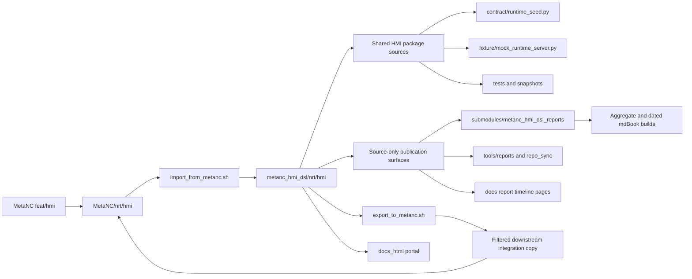

# Architecture Diagram

The important boundary is directional. Shared HMI code, fixtures, contracts,
tests, and generated snapshots can move between `MetaNC/nrt/hmi` and the
standalone package. Report history, report-generation tooling, and source-local
timeline pages remain in `metanc_hmi_dsl` and are filtered out of the MetaNC
integration copy.
