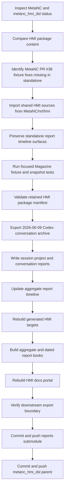

# Workflow Diagram

```mermaid
flowchart TD
  A[Inspect MetaNC and metanc_hmi_dsl status] --> B[Compare HMI package content]
  B --> C[Identify MetaNC PR #38 fixture fixes missing in standalone]
  C --> D[Import shared HMI sources from MetaNC/nrt/hmi]
  D --> E[Preserve standalone report timeline surfaces]
  E --> F[Run focused Magazine fixture and snapshot tests]
  F --> G[Validate retained HMI package manifest]
  G --> H[Export 2026-06-09 Codex conversation archive]
  H --> I[Write session project and conversation reports]
  I --> J[Update aggregate report timeline]
  J --> K[Rebuild generated HMI targets]
  K --> L[Build aggregate and dated report books]
  L --> M[Rebuild HMI docs portal]
  M --> N[Verify downstream export boundary]
  N --> O[Commit and push reports submodule]
  O --> P[Commit and push metanc_hmi_dsl parent]
```
