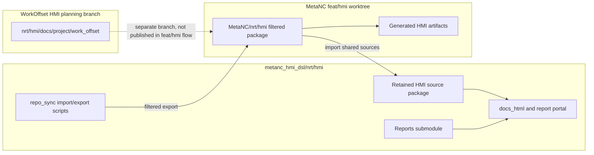

# Architecture Diagram

```mermaid
flowchart LR
  subgraph standalone["metanc_hmi_dsl/nrt/hmi"]
    source["Retained HMI source package"]
    reports["Reports submodule"]
    docs["docs_html and report portal"]
    syncTools["repo_sync import/export scripts"]
  end

  subgraph downstream["MetaNC feat/hmi worktree"]
    hmi["MetaNC/nrt/hmi filtered package"]
    generated["Generated HMI artifacts"]
  end

  subgraph planning["WorkOffset HMI planning branch"]
    planDocs["nrt/hmi/docs/project/work_offset"]
  end

  source --> docs
  reports --> docs
  syncTools -->|filtered export| hmi
  hmi --> generated
  hmi -->|import shared sources| source
  planDocs -.separate branch, not published in feat/hmi flow.-> hmi
```
