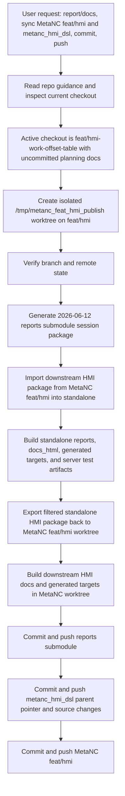

# Workflow Diagram

```mermaid
flowchart TD
  request["User request: report/docs, sync MetaNC feat/hmi and metanc_hmi_dsl, commit, push"]
  check["Read repo guidance and inspect current checkout"]
  anomaly["Active checkout is feat/hmi-work-offset-table with uncommitted planning docs"]
  worktree["Create isolated /tmp/metanc_feat_hmi_publish worktree on feat/hmi"]
  status["Verify branch and remote state"]
  report["Generate 2026-06-12 reports submodule session package"]
  import["Import downstream HMI package from MetaNC feat/hmi into standalone"]
  buildStandalone["Build standalone reports, docs_html, generated targets, and server test artifacts"]
  export["Export filtered standalone HMI package back to MetaNC feat/hmi worktree"]
  buildMetaNC["Build downstream HMI docs and generated targets in MetaNC worktree"]
  commitReports["Commit and push reports submodule"]
  commitStandalone["Commit and push metanc_hmi_dsl parent pointer and source changes"]
  commitMetaNC["Commit and push MetaNC feat/hmi"]

  request --> check --> anomaly --> worktree --> status
  status --> report --> import --> buildStandalone --> export --> buildMetaNC
  buildMetaNC --> commitReports --> commitStandalone --> commitMetaNC
```
